# Reinforcement Learning: From Fundamentals to Modern RL

**40 topics • 7 notebooks • Classical RL → Modern RL**

**Created by [Shivam Bharadwaj](https://github.com/bshivambharadwaj)**

Learn how agents make decisions—from your first Bellman update to PPO, LLM alignment, GRPO, and reasoning agents. Build intuition with a delivery robot, work through the mathematics, and run seven small, documented experiments on your CPU.

**[Start Learning](#topic-1) | [Notebooks](#practical-track) | [Advanced RL](#part-ii-advanced-and-modern-reinforcement-learning) | [Exercises](#exercises)**

⭐ If this course helps you, star this repo to help others discover it.

> **Course philosophy:** intuition → mathematics → algorithm → implementation → modern connection.

## Contents

- [How to Use This Course](#how-to-use-this-course)
- [Prerequisites](#prerequisites)
- [Course Roadmap](#course-roadmap)
- [What Makes This Course Different?](#what-makes-this-course-different)
- [Who This Course Is For](#who-this-course-is-for)
- [What You Will Learn](#what-you-will-learn)
- [Part I — Reinforcement Learning Fundamentals](#part-i-reinforcement-learning-fundamentals)
  - [1. What Is Reinforcement Learning?](#topic-1)
  - [2. The Agent–Environment Interaction](#topic-2)
  - [3. Markov Decision Processes](#topic-3)
  - [4. States, Actions, Rewards and Transitions](#topic-4)
  - [5. Policies](#topic-5)
  - [6. Returns and Discounting](#topic-6)
  - [7. State-Value Functions](#topic-7)
  - [8. Action-Value Functions](#topic-8)
  - [9. Advantage Functions](#topic-9)
  - [10. Bellman Expectation Equations](#topic-10)
  - [11. Bellman Optimality Equations](#topic-11)
  - [12. Dynamic Programming](#topic-12)
  - [13. Policy Evaluation](#topic-13)
  - [14. Policy Improvement](#topic-14)
  - [15. Policy Iteration](#topic-15)
  - [16. Value Iteration](#topic-16)
  - [17. Monte Carlo Methods](#topic-17)
  - [18. Temporal-Difference Learning](#topic-18)
  - [19. SARSA](#topic-19)
  - [20. Q-Learning and Exploration](#topic-20)
- [Part II — Advanced and Modern Reinforcement Learning](#part-ii-advanced-and-modern-reinforcement-learning)
  - [21. Function Approximation](#topic-21)
  - [22. Deep Q-Networks](#topic-22)
  - [23. Experience Replay](#topic-23)
  - [24. Target Networks](#topic-24)
  - [25. Policy Gradient Methods](#topic-25)
  - [26. REINFORCE](#topic-26)
  - [27. Actor–Critic Methods](#topic-27)
  - [28. Advantage Actor–Critic](#topic-28)
  - [29. Generalized Advantage Estimation](#topic-29)
  - [30. Trust Region Policy Optimization](#topic-30)
  - [31. Proximal Policy Optimization](#topic-31)
  - [32. Entropy Regularization](#topic-32)
  - [33. Offline Reinforcement Learning](#topic-33)
  - [34. Model-Based Reinforcement Learning](#topic-34)
  - [35. Multi-Agent Reinforcement Learning](#topic-35)
  - [36. Reinforcement Learning from Human Feedback](#topic-36)
  - [37. Reward Models and Preference Learning](#topic-37)
  - [38. Direct Preference Optimization](#topic-38)
  - [39. GRPO and Reinforcement Learning for Reasoning](#topic-39)
  - [40. Multimodal RL and RL for AI Agents](#topic-40)
- [Algorithm Comparison](#algorithm-comparison)
- [Practical Track](#practical-track)
- [Hands-on Checkpoints](#hands-on-checkpoints)
- [Suggested Learning Paths](#suggested-learning-paths)
- [Key Equations Cheat Sheet](#key-equations-cheat-sheet)
- [Exercises](#exercises)
- [Recommended References](#recommended-references)
- [Repository Structure](#repository-structure)
- [Course Design Principles](#course-design-principles)
- [Contributing](#contributing)
- [License](#license)

---

<a id="how-to-use-this-course"></a>

## How to Use This Course

Read each topic in this order: intuition, equation, worked example, then algorithm. Keep asking: **what is observed, what is learned, and what target drives the update?** You do not need to memorize every equation on the first pass.

Use the README for intuition and worked examples, then follow the **Try it in Notebook** links to runnable experiments. Each notebook includes saved results, correctness checks, and exercises with hints.

<a id="prerequisites"></a>

### Prerequisites

- **Python:** functions, loops, arrays, and basic NumPy.
- **Calculus:** derivatives, partial derivatives, and the chain rule.
- **Probability:** expectations, conditional probability, and sampling.
- **Linear algebra:** vectors, matrices, and dot products.

You do not need previous RL experience. Basic neural-network and gradient-descent knowledge will help from Topic 21 onward. Difficulty labels below describe the progression within this course.

**Visual guide:** these course notes use ink-plum, antique gold, sage, and warm paper. Each diagram labels context, decisions, learning, and results; small numbered arrows refer to the notes below the chart.

### Running Example: A Delivery Robot

A robot carries a parcel through a small town. Each ordinary move costs −1, successful delivery gives +10 on the final transition, and delivery ends the episode. Some examples add traffic, battery constraints, or failure penalties explicitly. This setting lets us reuse one intuition across many algorithms.

<p align="center">
  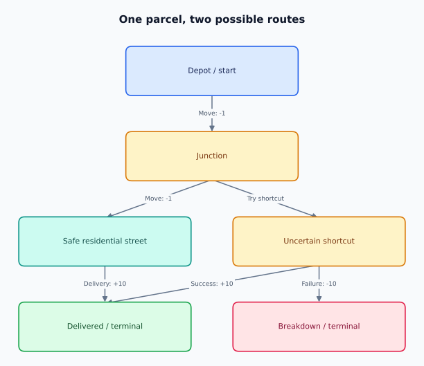
</p>

The safe trajectory has rewards [−1,−1,+10]. The shortcut illustrates uncertainty; its probabilities and entry cost must be specified before calculating its expected return. The robot's challenge is to choose actions with good total outcomes, not merely avoid every immediate cost.

### Notation Guide

| Symbol | Meaning |
|---|---|
| S<sub>t</sub>,A<sub>t</sub>,R<sub>t+1</sub> | State, action, and reward received after that action |
| s,a,r,s&#x27; | Concrete sampled transition values |
| π(a&#124;s) | Policy's probability of action a in state s |
| P(s&#x27;&#124;s,a) | Next-state transition probability |
| p(s&#x27;,r&#124;s,a) | Joint next-state and reward probability |
| γ | Discount factor |
| G<sub>t</sub> | Discounted return starting at time t |
| V<sup>π</sup>,Q<sup>π</sup>,A<sup>π</sup> | State value, action value, and advantage under π |
| α | Learning rate: how far an estimate moves toward a target |
| θ,w,φ | Learned parameters of policies, values, or reward models |
| λ | Trace parameter used in GAE and related estimators |
| ε | Exploration probability or PPO clipping width, depending on section |
| d | True-termination indicator: one if no future task reward remains |
| 𝔼,∇,arg max  | Expectation, gradient, and an input attaining the maximum |

Uppercase letters denote random variables; lowercase letters usually denote observed values. PPO's r<sub>t</sub>(θ) is a **probability ratio**, not the environment reward R<sub>t+1</sub>. Terminal bootstrap values are zero; simplified equations that omit a termination mask rely on this convention.

<a id="course-roadmap"></a>

## Course Roadmap

**Foundations → Value-Based RL → Deep RL → Policy Optimization → RLHF → Reasoning/Agents**

<p align="center">
  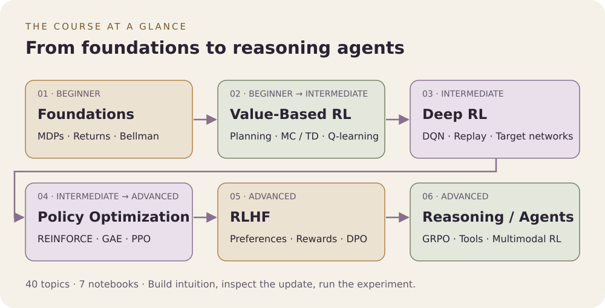
</p>

| Stage | Difficulty | Learning progression | Practice |
|---|---|---|---|
| [Foundations · 1–11](#topic-1) | Beginner | Define the decision problem, then connect rewards, returns, values, and Bellman equations. | Trace a small MDP in Notebook 01. |
| [Value-Based RL · 12–20](#topic-12) | Beginner → Intermediate | First plan with a known model; then learn values from sampled experience using MC, TD, SARSA, and Q-learning. | Notebooks 01–03. |
| [Deep RL · 21–24](#topic-21) | Intermediate | Replace a Q-table with a network and learn why replay and target networks matter. | Notebook 04. |
| [Policy Optimization · 25–32](#topic-25) | Intermediate → Advanced | Optimize action probabilities directly, then add baselines, a critic, GAE, and PPO clipping. | Notebooks 05–06. |
| [RLHF and Preferences · 36–38](#topic-36) | Advanced | Replace a hand-written reward with preference feedback; distinguish reward modeling, PPO-based RLHF, and DPO. | Notebook 07: synthetic preferences and DPO. |
| [Reasoning and Agents · 39–40](#topic-39) | Advanced | Connect group-relative advantages to reasoning tasks, then define observations, actions, and feedback for multimodal and tool-using agents. | Notebook 07: simplified GRPO; Topic 40 design exercises. |

After policy optimization, read **[Topics 33–35](#topic-33)** as a bridge: offline data changes what you can learn from, world models change how you plan, and multiple agents change whose behavior affects the environment. Then continue to preference learning and reasoning.

Before moving on, explain the current method's **data source, update target, and evaluation rule** without looking at the notes. The modern lessons build on these same choices; Notebook 07 illustrates their objectives with a small response space rather than training a language model.

<a id="what-makes-this-course-different"></a>

### What Makes This Course Different?

- **One connected progression:** Bellman equations lead into deep RL, PPO, LLM alignment, DPO, and GRPO.
- **Intuition you can test:** analogies and worked examples connect to seven self-contained notebooks with saved plots and seeded experiments.
- **Modern systems in context:** reasoning, multimodal RL, and agents build on the classical foundations, with clear distinctions between working toy implementations and conceptual extensions.

<a id="who-this-course-is-for"></a>

## Who This Course Is For

This course is designed for engineers, researchers, and students who already know basic Python and machine learning and want to understand both classical RL and the ideas behind modern post-training and agentic AI systems.

<a id="what-you-will-learn"></a>

## What You Will Learn

By the end of the course, you should be able to:

- formulate sequential decision problems as MDPs;
- understand policies, returns, value functions, Q-functions, and advantages;
- derive and interpret Bellman equations;
- implement dynamic programming, Monte Carlo, TD, SARSA, and Q-learning;
- understand why function approximation changes the RL problem;
- explain DQN, policy gradients, actor–critic methods, GAE, TRPO, and PPO;
- understand offline RL, model-based RL, and multi-agent RL;
- connect classical RL to RLHF, preference optimization, GRPO, reasoning models, multimodal models, and agents.

---

<a id="part-i-reinforcement-learning-fundamentals"></a>

# Part I — Reinforcement Learning Fundamentals

<a id="topic-1"></a>

## 1. What Is Reinforcement Learning?

Reinforcement Learning (RL) studies how an **agent learns to make decisions through interaction** with an environment.

Unlike supervised learning, the agent is not normally given the correct action for every situation. It acts, observes consequences, receives a reward signal, and gradually learns behavior that maximizes long-term return.

The basic interaction is:

<p align="center">
  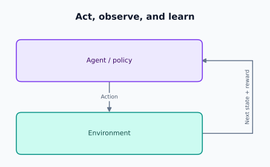
</p>

The central challenge is that an action can affect not only the immediate reward but also the states—and therefore rewards—the agent encounters later.

A common objective is

<p align="center">
  
</p>

RL is therefore fundamentally about **sequential decision making under uncertainty**.

**Modern connection:** language-model agents choosing tools, robots choosing movements, recommendation systems choosing content, and reasoning models choosing intermediate steps can all be viewed through this lens when an appropriate state, action, and feedback process can be defined.


### Intuition: learning to deliver a parcel

Imagine a delivery robot that must reach a house. Nobody labels the best move at every junction. The robot tries routes, pays a small cost for travel, and earns a reward when it delivers the parcel. A shortcut may save time but risk a costly collision. Learning means using experience to choose routes with better **total consequences**.

| Learning setting | Feedback | Delivery analogy |
|---|---|---|
| Supervised learning | Correct target for each training example | Copy routes labeled by an expert |
| Unsupervised learning | Structure in unlabeled data | Group streets by their visual appearance |
| Reinforcement learning | Rewards resulting from actions | Try routes and learn which deliveries work well |

Two difficulties make RL distinctive: **delayed credit assignment** (which earlier turn caused success?) and **action-dependent data** (the chosen route determines what the robot sees next). A reward is feedback, not an instruction identifying the correct action.

---

<a id="topic-2"></a>

## 2. The Agent–Environment Interaction

At time step t:

1. the agent observes state S<sub>t</sub>;
2. it selects action A<sub>t</sub>;
3. the environment transitions;
4. the agent receives reward R<sub>t+1</sub> and next state S<sub>t+1</sub>.

A trajectory can be written as

<p align="center">
  
</p>

An **episode** is a trajectory that terminates. Chess and many games are episodic. Server resource management can instead be a continuing task.

The abstraction matters because RL algorithms operate on these interactions rather than on isolated input-label pairs.


### Follow one interaction

At a junction, the robot observes its location and battery level, chooses “go east,” spends one unit of energy, and reaches another junction. That gives one transition (s,a,r,s&#x27;). An episode might run from parcel pickup until delivery or failure.

<p align="center">
  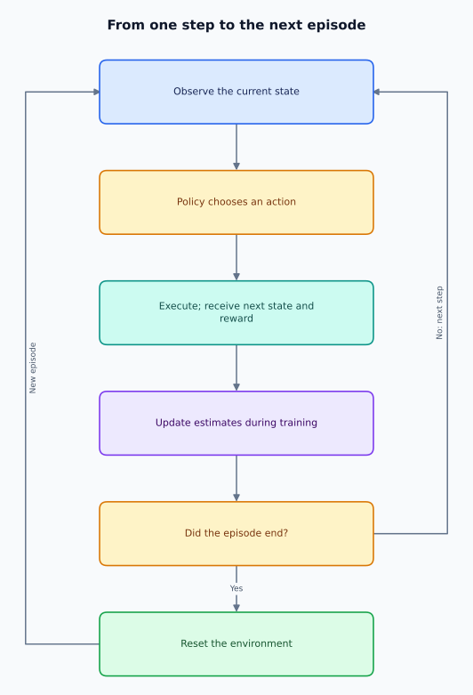
</p>

A **time step** is one interaction; an **episode** contains many steps; a **training run** usually contains many episodes. During evaluation, we normally freeze the learned parameters to measure the behavior we have learned.

---

<a id="topic-3"></a>

## 3. Markov Decision Processes

**[Try it in Notebook 01 → MDPs and Dynamic Programming](notebooks/01_mdp_dynamic_programming.ipynb)**

A Markov Decision Process (MDP) provides the standard mathematical model for RL:

<p align="center">
  
</p>

Where:

- 𝒮 — state space;
- 𝒜 — action space;
- P(s&#x27;&#124;s,a) — transition dynamics;
- R — reward specification;
- γ∈[0,1] — discount factor.

The **Markov property** says that the current state contains the information needed to predict the future given the action:

<p align="center">
  
</p>

This does not mean the real world has no history. It means that a well-designed state representation should summarize the relevant history.

For an AI agent, a state might include conversation context, tool results, memory, and task progress rather than a single physical observation.


### What makes a state sufficient?

Location alone may be insufficient: the same route can be feasible with a full battery and impossible with an empty one. Including battery charge makes the state more informative. If traffic depends on time of day, the clock may matter too.

An **observation** is what the agent can sense; a **state** is a sufficient description for predicting transitions and rewards. A camera image may hide a vehicle behind a wall. This leads to a **partially observable MDP (POMDP)**, where an agent can use observation history, memory, or a belief distribution over possible states.

For finite discounted problems we normally assume 0≤γ&lt;1 and bounded rewards. Undiscounted episodic problems can use γ=1 when termination and integrability make returns well-defined. An initial-state distribution ρ<sub>0</sub> specifies where episodes begin; together with the policy it determines the expected course objective.

---

<a id="topic-4"></a>

## 4. States, Actions, Rewards and Transitions

These four objects define the decision problem.

### State
A representation of the information available for decision making.

### Action
A choice available to the agent. Actions can be discrete, continuous, structured, or even textual.

### Reward
A scalar feedback signal describing immediate desirability:

<p align="center">
  
</p>

Reward is **not the same thing as the objective behavior itself**. Poorly designed rewards can produce unintended strategies—often called reward hacking or specification gaming.

### Transition
The environment dynamics:

<p align="center">
  
</p>

Some environments are deterministic; many practical environments are stochastic.


### Specify the delivery task before choosing an algorithm

| Component | Example | Why the choice matters |
|---|---|---|
| State | Position, battery, parcel status | Missing information can make decisions ambiguous |
| Action | North, south, east, west, recharge | Determines what the agent can control |
| Reward | −1 per ordinary move, +10 on delivery | Defines the trade-offs being optimized |
| Transition | A move succeeds with probability 0.9 | Captures uncertainty in consequences |
| Termination | Delivery or battery exhaustion | Defines when future reward stops |

Here, delivery reward replaces the ordinary movement cost on the final step. State such conventions explicitly: small ambiguities change the optimization problem.

**Analogy:** rewarding a courier only for distance traveled could teach endless driving. Reward should reflect successful delivery and relevant costs. The environment can also forbid impossible actions; a penalty and a hard action constraint are different mechanisms.

---

<a id="topic-5"></a>

## 5. Policies

A policy describes the agent's behavior.

A stochastic policy is

<p align="center">
  
</p>

A deterministic policy maps states directly to actions:

<p align="center">
  
</p>

RL tries to find a policy that performs well according to the chosen objective. Importantly, the policy is not necessarily a lookup table. In deep RL it is often a neural network parameterized by θ:

<p align="center">
  
</p>

For language models, token generation itself can be interpreted as a stochastic policy over the vocabulary conditioned on context.


### A policy is a decision rule, not a route

A fixed route says “east, east, north.” A policy says “at this junction, with this battery level, choose east with probability 0.8 and north with probability 0.2.” It can react when an unexpected event changes the state.

For discrete actions, probabilities satisfy ∑<sub>a</sub>π(a&#124;s)=1 and π(a&#124;s)≥0. A neural policy commonly outputs logits, then uses softmax to obtain these probabilities. For continuous controls, it might output a Gaussian distribution over steering angles instead.

**Behavior policy** means the policy collecting experience. **Target policy** means the policy being evaluated or improved. Keeping these roles separate will explain the difference between SARSA and Q-learning.

---

<a id="topic-6"></a>

## 6. Returns and Discounting

Immediate reward alone is insufficient for long-horizon decisions. RL therefore defines the **return**:

<p align="center">
  
</p>

Equivalently,

<p align="center">
  
</p>

The discount factor γ controls how future rewards contribute to current value.

- γ=0: only immediate reward matters.
- γ close to 1: long-term consequences matter strongly.

Discounting can encode time preference, help keep continuing-task returns finite, and affect the effective planning horizon.


### Worked example: immediate reward versus return

Suppose the robot receives rewards −1,−1,+10 and then terminates. With γ=0.9:

<p align="center">
  
</p>

Working backward gives G<sub>2</sub>=10, G<sub>1</sub>=−1+0.9(10)=8, and G<sub>0</sub>=−1+0.9(8)=6.2. This is why the recursive definition is useful in code.

**Analogy:** a student may spend effort now to gain a useful skill later. Looking only at today's cost would miss the eventual benefit. Discounting determines how heavily later benefits count; it is not itself a measure of uncertainty in a learned value.

For bounded rewards and γ&lt;1, the geometric weights keep the infinite sum bounded. The rough effective horizon 1/(1−γ) is a useful intuition, not a hard cutoff.

---

<a id="topic-7"></a>

## 7. State-Value Functions

The state-value function answers:

> How good is it to be in state s while following policy π?

<p align="center">
  
</p>

Values compress potentially long future trajectories into a single expectation. They are therefore powerful tools for evaluating decisions without explicitly enumerating every future outcome at decision time.


### Value averages over possible futures

Suppose following the current policy from a junction produces return 10 half the time and 2 half the time. Then V<sup>π</sup>(s)=6. A value estimate of 6 does not promise that any single delivery will earn exactly 6.

**Analogy:** a city's average travel time describes what to expect, not the duration of every trip. Likewise, state value depends on both the environment and the policy: a skilled robot and an inexperienced robot can have different values for the same junction.

We conventionally set the value of a terminal state to zero because no future rewards remain after entry. The reward for reaching it belongs to the transition into that state.

---

<a id="topic-8"></a>

## 8. Action-Value Functions

The action-value function answers:

> How good is taking action a in state s, then following π?

<p align="center">
  
</p>

If Q is known, action selection can be straightforward:

<p align="center">
  
</p>

for a greedy deterministic policy.

Q-learning and DQN build directly on this idea.


### Compare options at one junction

Suppose Q<sup>π</sup>(s,east)=8 and Q<sup>π</sup>(s,north)=3. These values include the first chosen action and all subsequent behavior under π.

The connection to state value is

<p align="center">
  
</p>

If the policy chooses each action equally often, V<sup>π</sup>(s)=5.5. A greedy improvement would choose east. Greedy behavior with respect to an inaccurate estimate is not necessarily optimal, and greedifying Q<sup>π</sup> once need not produce the globally optimal policy.

**Analogy:** V rates your overall prospects at a junction; Q rates the individual roads available there.

---

<a id="topic-9"></a>

## 9. Advantage Functions

The advantage function measures whether an action is better or worse than the policy's typical action at that state:

<p align="center">
  
</p>

Interpretation:

- A&gt;0: action is better than the state baseline;
- A&lt;0: action is worse;
- A≈0: action is close to expected behavior.

Advantages are central to modern policy-gradient algorithms because subtracting a baseline can reduce variance without changing the expected policy-gradient direction.


### Worked example: better than your usual choice

Using the previous equal-probability policy, V<sup>π</sup>(s)=5.5. Therefore:

<p align="center">
  
</p>

North still has positive expected return, but it is worse than this policy's average choice. That distinction matters when improving behavior.

**Analogy:** scoring 70 on an exam means something different when your expected score was 50 versus 90. Advantage measures performance relative to expectation. For the exact value functions, ∑<sub>a</sub>π(a&#124;s)A<sup>π</sup>(s,a)=0; sampled or approximate advantages need not average to exactly zero.

---

<a id="topic-10"></a>

## 10. Bellman Expectation Equations

The Bellman equation introduces one of RL's deepest ideas: **a long-horizon value can be decomposed recursively**.

For state value:

<p align="center">
  
</p>

Expanded over actions and transitions:

<p align="center">
  
</p>

Conceptually:

<p align="center">
  
</p>

This recursive structure is the foundation of dynamic programming and temporal-difference learning.


### One-step lookahead, with numbers

Suppose an action gives reward −1, then reaches a state of value 8 with probability 0.75 or value 4 with probability 0.25. Its expected one-step target is

<p align="center">
  
</p>

For V<sup>π</sup>, also average these action-specific targets using the policy's action probabilities. For Q<sup>π</sup>, fix the first action and average subsequent actions under the policy:

<p align="center">
  
</p>

**Analogy:** the remaining travel time equals time to the next junction plus remaining travel time from there. Bellman equations express this consistency for expected discounted reward.

---

<a id="topic-11"></a>

## 11. Bellman Optimality Equations

For the optimal value function:

<p align="center">
  
</p>

For action values:

<p align="center">
  
</p>

Once Q<sup>∗</sup> is known, an optimal action can be selected greedily:

<p align="center">
  
</p>

The difference from the expectation equation is crucial: evaluation asks what happens **under a policy**; optimality asks what happens when future choices are optimal.


### Average the uncertainty; maximize the choice

The agent controls its action but cannot choose which random outcome occurs. That is why the maximum goes over actions while an expectation remains over next states and rewards.

<p align="center">
  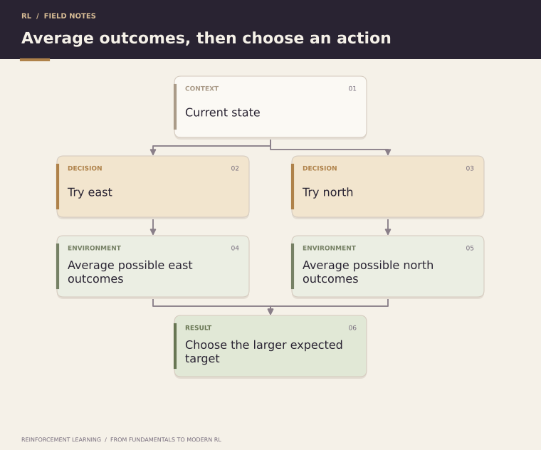
</p>

**Analogy:** choose the route with the best expected travel result, not the route whose luckiest possible traffic conditions are best. For finite discounted MDPs, Bellman optimality has a unique value-function solution, although several actions can tie for optimality.

---

<a id="topic-12"></a>

## 12. Dynamic Programming

Dynamic Programming (DP) solves MDPs when the environment model is known.

The key operation is a **Bellman backup**:

<p align="center">
  
</p>

DP is rarely the final solution for huge modern environments because exact dynamics and full state sweeps are often unavailable. But it provides the conceptual blueprint for much of RL.

**[Try it in Notebook 01 → MDPs and Dynamic Programming](notebooks/01_mdp_dynamic_programming.ipynb)**


### What having a model means

A model tells us the probabilities and rewards for each possible transition. DP uses this information to calculate expected targets instead of estimating them from sampled trips. Here, “programming” means organizing a recursive optimization, not a particular programming language.

A full backup enumerates outcomes, computes reward plus discounted next-state value, and combines them by averaging or maximizing as appropriate. A sweep applies backups across states.

**Analogy:** if you have a complete road map with reliable travel-time distributions, you can compare routes at your desk. Without that map, you must learn from journeys. DP assumes the model is available; learning a model from experience belongs to model-based RL.

---

<a id="topic-13"></a>

## 13. Policy Evaluation

Policy evaluation estimates V<sup>π</sup> for a fixed policy.

An iterative update is

<p align="center">
  
</p>

Repeated Bellman expectation backups converge to V<sup>π</sup> under standard finite discounted-MDP assumptions.

This gives us the first half of a powerful pattern:

**evaluate the current behavior before improving it.**


### How to evaluate a fixed policy

1. Initialize each nonterminal value, often to zero; keep terminal values at zero.
2. For every state, compute the expectation backup using the fixed policy.
3. Repeat until the largest value change is below a chosen tolerance.

If the first trip segment costs 1 and leads deterministically to a state currently valued at 8, its target with γ=0.9 is 6.2. Repeated sweeps propagate downstream rewards backward through the state space.

**Analogy:** estimate how well the courier's existing route-selection rule works before changing that rule. Evaluation changes the value estimates; it does not change the policy. A small numerical tolerance gives approximate evaluation, not exact equality.

---

<a id="topic-14"></a>

## 14. Policy Improvement

Suppose we know V<sup>π</sup>. We can improve the policy by choosing actions that look better according to one-step lookahead:

<p align="center">
  
</p>

The policy improvement theorem explains why a policy constructed greedily with respect to the current value function is at least as good as the original policy under the usual assumptions.

This creates the evaluation–improvement loop at the heart of many RL algorithms.


### Why the improvement is justified

For each state, calculate the expected reward plus discounted V<sup>π</sup> for every action. The largest of these numbers is at least their average under π. Consequently, choosing a maximizing action gives Q<sup>π</sup>(s,π&#x27;(s))≥V<sup>π</sup>(s).

With exact evaluation in the standard discounted setting, repeatedly using those improved choices yields V<sup>π&#x27;</sup>(s)≥V<sup>π</sup>(s) for every state. Approximate learned values can misrank actions, so this guarantee does not automatically transfer to neural-network training.

**Analogy:** improve the courier's instructions one junction at a time using an accurate assessment of the existing plan. When actions tie, use a consistent tie-breaking rule to avoid unnecessary policy changes.

---

<a id="topic-15"></a>

## 15. Policy Iteration

Policy iteration alternates:

<p align="center">
  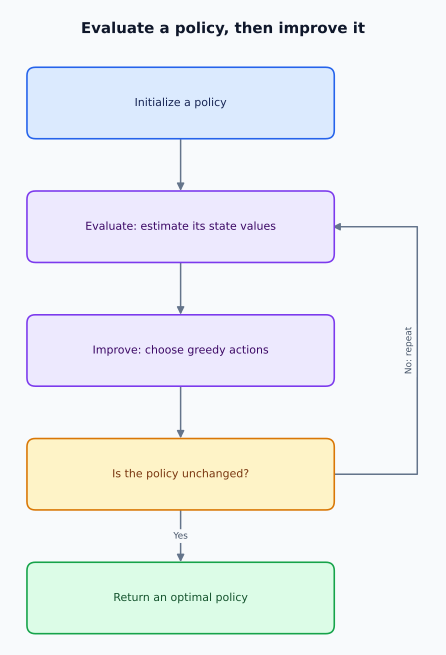
</p>

It exposes a recurring RL pattern: **prediction + control**.

Prediction estimates how good behavior is. Control changes behavior to make it better.


### A complete planning loop

```text
Choose an initial policy.
Repeat:
    Evaluate that policy to obtain V.
    At each state, choose an action maximizing expected reward + gamma * V(next).
    If the policy did not change, stop.
```

**Analogy:** a delivery manager measures the current routing plan, revises it using those measurements, then measures the revised plan. Evaluation and improvement solve different subproblems and help each other.

For a finite discounted MDP, exact policy iteration with consistent tie handling reaches an optimal policy. The main cost is evaluation, especially when there are many states. Using only a few evaluation sweeps gives a modified policy-iteration approach.

---

<a id="topic-16"></a>

## 16. Value Iteration

Value iteration combines truncated evaluation and improvement into a single optimality update:

<p align="center">
  
</p>

Once values converge, derive the greedy policy.

Policy iteration performs more explicit evaluation between improvements; value iteration performs frequent improvement with shorter evaluation. Both are manifestations of **generalized policy iteration**.

**[Try it in Notebook 01 → MDPs and Dynamic Programming](notebooks/01_mdp_dynamic_programming.ipynb)**


### Compare the two DP algorithms

| Method | Work before improving decisions | Stopping idea |
|---|---|---|
| Policy iteration | Evaluate the current policy, then improve it | Policy stops changing |
| Value iteration | Apply one optimality backup per state per sweep | Values change by less than a tolerance |

**Analogy:** policy iteration fully reviews a route plan before revising it; value iteration keeps revising short estimates as information spreads through the map. Value iteration does not require a separately stored policy during the value updates.

After stopping, extract a greedy policy using reward plus discounted next-state value. For finite discounted MDPs, the Bellman optimality operator contracts maximum value error by at most γ each application, explaining convergence. Stopping at a tolerance produces an approximation.

---

<a id="topic-17"></a>

## 17. Monte Carlo Methods

**[Try it in Notebook 02 → Monte Carlo versus TD](notebooks/02_mc_vs_td.ipynb)**

What if the transition model is unknown?

Monte Carlo (MC) methods learn from complete sampled episodes. After observing a return G<sub>t</sub>, a value estimate can be updated toward it:

<p align="center">
  
</p>

MC methods:

- do not require a model;
- learn from experience;
- use actual sampled returns;
- typically wait until enough future rewards are observed, often the end of an episode.

Their estimates can have high variance because the full sampled return is noisy.


### Learn from completed trips

If visits to a junction have produced returns 4, 8, and 6, their sample mean is 6. Using α=1/N(s) recovers an incremental sample mean, where N(s) counts included returns for that state. A constant learning rate instead keeps adapting to recent data.

**First-visit MC** uses the first occurrence of a state in each episode; **every-visit MC** uses every occurrence. Repeated visits within one episode are correlated, so they should not be treated as independent evidence.

**Analogy:** judge a route only after completing the delivery. You observe the whole outcome, but traffic and later choices can make that outcome noisy. For a fixed policy and suitable sampling, MC targets avoid bootstrap bias, although finite-sample estimates remain uncertain.

---

<a id="topic-18"></a>

## 18. Temporal-Difference Learning

Temporal-Difference (TD) learning combines ideas from Monte Carlo and dynamic programming.

TD(0) uses

<p align="center">
  
</p>

The target

<p align="center">
  
</p>

contains an existing estimate. This is called **bootstrapping**.

<p align="center">
  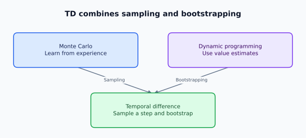
</p>

TD can learn before an episode ends and is one of the most important ideas in RL.

**[Try it in Notebook 02 → Monte Carlo versus TD](notebooks/02_mc_vs_td.ipynb)**


### A numerical TD update

Suppose V(s)=5, the next reward is −1, V(s&#x27;)=8, γ=0.9, and α=0.1. The target is 6.2, the TD error is 1.2, and the updated value is 5.12.

**Analogy:** update your expected arrival time after reaching the next junction, using your current estimate for the remaining journey. You do not need to finish the trip first.

| Method | Uses sampled transitions? | Bootstraps? | Needs the full episode for its standard target? |
|---|---|---|---|
| DP | No; uses the model | Yes | No |
| Monte Carlo | Yes | No | Yes |
| TD(0) | Yes | Yes | No |

At a true terminal transition, the TD target is just the reward. A time-limit cutoff may still require bootstrapping if it merely interrupts a continuing task.

---

<a id="topic-19"></a>

## 19. SARSA

**[Try it in Notebook 03 → SARSA and Q-Learning](notebooks/03_q_learning.ipynb)**

SARSA is an **on-policy** TD control algorithm. Its name comes from the transition tuple:

<p align="center">
  
</p>

Update:

<p align="center">
  
</p>

Because the next action is sampled from the behavior policy, the learned action values reflect the policy actually being followed, including its exploration behavior.


### SARSA learns about the behavior you actually use

Suppose the next state has Q-values 8 and 2, but exploration selects the second action. With reward −1 and γ=0.9, SARSA's target is −1+0.9(2)=0.8.

**Analogy:** a courier accounts for their own occasional navigation mistakes when choosing how close to a dangerous road edge to travel. In a cliff-walking environment, an exploratory SARSA policy can favor a safer route because its values include the cost of exploratory moves.

Choose the next action before forming the update, then actually execute that same action on the next step. Resampling it afterward would break the intended transition sequence. If the episode truly terminates, omit the next-action value entirely.

---

<a id="topic-20"></a>

## 20. Q-Learning and Exploration

Q-learning uses the target

<p align="center">
  
</p>

and update

<p align="center">
  
</p>

It is **off-policy**: the behavior policy can explore while the update targets a greedy policy.

A common exploration strategy is ε-greedy:

<p align="center">
  
</p>

This introduces the **exploration–exploitation trade-off**: use what we know, or gather information that may improve future decisions?

**[Try it in Notebook 03 → SARSA and Q-Learning](notebooks/03_q_learning.ipynb)**


### Q-learning learns a greedy target while exploring

For the same next-state values 8 and 2, Q-learning's target is −1+0.9max (8,2)=6.2, even if behavior selects the second action next. This is the precise contrast with SARSA's 0.8 target above.

**Analogy:** test unfamiliar restaurants to gather information while keeping a separate estimate of the best known dining choice. With n actions and uniform random exploration, the unique greedy action is selected with probability 1−ε+ε/n.

<p align="center">
  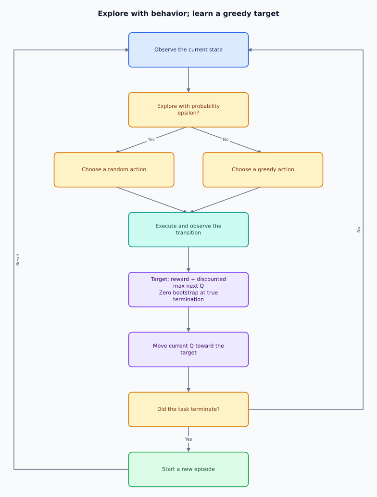
</p>

The diagram's next-Q term is zero at termination. Tabular convergence requires sufficient state-action coverage and suitable decreasing step sizes; it is not guaranteed just by using the update equation. Exploration that decays too quickly can leave useful actions undiscovered.

---

<a id="part-ii-advanced-and-modern-reinforcement-learning"></a>

# Part II — Advanced and Modern Reinforcement Learning

<a id="topic-21"></a>

## 21. Function Approximation

Tabular methods store a separate value for each state or state-action pair. That becomes impossible when spaces are huge or continuous.

Instead, approximate:

<p align="center">
  
</p>

Neural networks can generalize across similar states, but approximation also introduces instability: changing parameters for one sample can change predictions for many others.

This transition—from tables to learned representations—is what makes **deep reinforcement learning** possible.


### Generalization is useful and risky

A table memorizes each junction separately. A function approximator can learn that low battery is risky across many junctions, including ones rarely visited. Features may be hand-designed, linear, or learned by a network.

**Analogy:** replace a notebook of individual addresses with a rule that generalizes across neighborhoods. An incorrect rule can also spread mistakes widely.

The **deadly triad** refers to function approximation, bootstrapping, and off-policy learning together: this combination can make value learning diverge. Deep RL therefore needs care with targets, data distributions, and optimization. Increasing network size does not by itself solve these problems.

---

<a id="topic-22"></a>

## 22. Deep Q-Networks

**[Try it in Notebook 04 → DQN](notebooks/04_dqn.ipynb)**

A Deep Q-Network (DQN) approximates

<p align="center">
  
</p>

with a neural network.

A typical squared TD objective is

<p align="center">
  
</p>

with target

<p align="center">
  
</p>

DQN demonstrated that value-based RL could learn useful policies directly from high-dimensional observations when combined with stabilization techniques.


### From the Q-table to a network

For a small discrete action set, the network takes a state and outputs one Q-value per action. The selected action's prediction is trained toward a detached target:

<p align="center">
  
</p>

where d=1 means true termination. Detaching means that the target is treated as constant when differentiating the loss. A Huber loss is also commonly used to reduce sensitivity to large TD errors.

**Analogy:** the network is a shared route-rating system; replay supplies past journeys and a target network supplies a more stable estimate of what comes next. Standard DQN fits discrete actions naturally because it can enumerate them; maximizing over arbitrary continuous actions requires additional machinery.

---

<a id="topic-23"></a>

## 23. Experience Replay

Sequential observations are strongly correlated. Training directly on consecutive transitions can make neural optimization unstable.

Experience replay stores transitions:

<p align="center">
  
</p>

in a replay buffer and samples minibatches later.

Benefits include:

- reusing experience;
- reducing temporal correlation in minibatches;
- improving data efficiency;
- making training closer to standard minibatch optimization.

Replay also makes the data distribution partly off-policy because stored transitions may have been generated by older policies.


### How replay is used

<p align="center">
  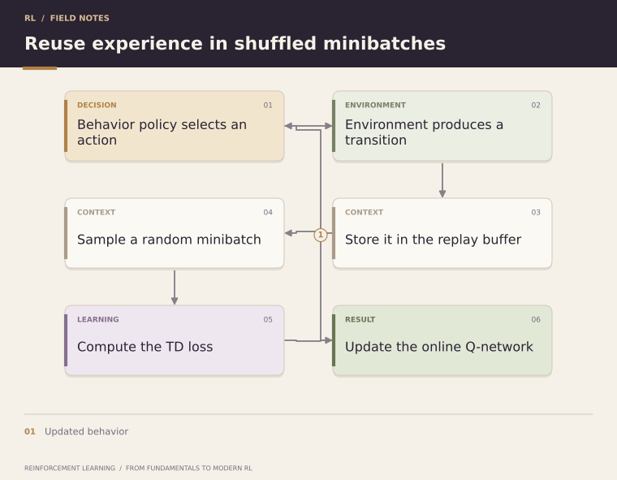
</p>

**Analogy:** shuffle practice questions instead of repeatedly studying adjacent pages. Minibatches become less temporally correlated, but replay does not make the underlying experience perfectly independent or eliminate distribution shift.

Buffer capacity determines how long experiences remain available. Too small a buffer offers little diversity; a very large buffer can contain stale behavior. Plain replay fits off-policy DQN, but old trajectories cannot simply be substituted into an on-policy policy-gradient estimator without considering the mismatch.

---

<a id="topic-24"></a>

## 24. Target Networks

If the same rapidly changing network predicts both the current Q-value and its bootstrap target, the target itself moves during optimization.

DQN therefore maintains a target network θ<sup>−</sup>:

<p align="center">
  
</p>

The target parameters are periodically copied or slowly updated from the online network.

Together, **experience replay + target networks** address two major sources of instability in deep Q-learning.

**[Try it in Notebook 04 → DQN](notebooks/04_dqn.ipynb)**


### Hold the measuring stick steady

For a hard update, periodically set θ<sup>−</sup>←θ. A soft update instead uses

<p align="center">
  
</p>

where a small τ∈(0,1] makes the target change slowly.

**Analogy:** it is easier to aim at a target that pauses between movements. The target network is not a second independently optimized critic in standard DQN; it follows the online network.

A minimal DQN loop is: collect transitions, store them, sample a minibatch, construct masked detached targets, update the online network, and occasionally update the target network. These techniques improve stability but do not guarantee convergence with nonlinear approximation.

---

<a id="topic-25"></a>

## 25. Policy Gradient Methods

**[Try it in Notebook 05 → Policy Gradients](notebooks/05_policy_gradient.ipynb)**

Instead of learning values and deriving a policy, policy-gradient methods optimize policy parameters directly:

<p align="center">
  
</p>

The objective is

<p align="center">
  
</p>

The policy-gradient theorem gives a gradient of the form

<p align="center">
  
</p>

This formulation naturally supports stochastic policies and large or continuous action spaces.


### Why the log probability appears

The likelihood-ratio identity ∇<sub>θ</sub>p<sub>θ</sub>=p<sub>θ</sub>∇<sub>θ</sub>log p<sub>θ</sub> lets us estimate how changing action probabilities changes expected return. We need differentiable policy probabilities, but we do not need to differentiate through the environment's transition dynamics.

**Analogy:** increase the chance of choosing a route when evidence says it produces better outcomes. The update changes the probability distribution over actions, not the action that already occurred.

The expectation in a policy-gradient formula must use the appropriate policy-induced state distribution. For the discounted episodic objective defined earlier, an explicit trajectory estimator includes γ<sup>t</sup>G<sub>t</sub> at time t; equivalent theorem statements may absorb discount weights into a discounted visitation distribution. This convention matters when translating notation into code.

---

<a id="topic-26"></a>

## 26. REINFORCE

REINFORCE is a Monte Carlo policy-gradient algorithm:

<p align="center">
  
</p>

Intuitively:

- positive return weights reinforce sampled actions;
- negative return weights discourage sampled actions;
- a baseline makes the weights relative to expected performance.

Its weakness is high variance. A baseline can reduce variance:

<p align="center">
  
</p>

Choosing b(S<sub>t</sub>)=V(S<sub>t</sub>) leads naturally toward advantage-based actor–critic methods.

**[Try it in Notebook 05 → Policy Gradients](notebooks/05_policy_gradient.ipynb)**


### A complete REINFORCE update

For a finite episode and the discounted start-state objective, one estimator is

<p align="center">
  
</p>

Collect an episode, compute its returns backward, evaluate log probabilities, and ascend along ĝ. When using a loss-minimizing optimizer, minimize the negative of the corresponding weighted log-probability sum. Treat the return and baseline weights as fixed in the actor gradient.

**Analogy:** after a delivery, reinforce decisions according to how much better or worse the outcome was than expected. With a baseline, a positive residual reinforces a sampled action and a negative residual discourages it. Without a baseline, a low but positive return still contributes a positive weight; “poor return” alone does not imply a negative update.

A state-only baseline preserves the expected gradient because ∑<sub>a</sub>π(a&#124;s)∇log π(a&#124;s)=0. It can reduce variance without supplying a new reward objective.

---

<a id="topic-27"></a>

## 27. Actor–Critic Methods

**[Try it in Notebook 06 → PPO](notebooks/06_ppo.ipynb)**

Actor–critic methods combine two learners:

<p align="center">
  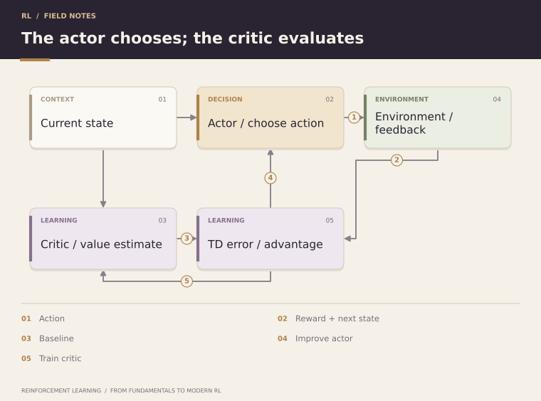
</p>

The **actor** changes the policy. The **critic** estimates value information used to judge the actor's actions.

A typical actor update uses

<p align="center">
  
</p>

This architecture underlies many modern RL algorithms.


### The performer and the coach

The actor is the courier choosing roads; the critic is a coach estimating how promising each situation is. The coach does not select actions directly in a state-value actor–critic, but provides feedback for changing their probabilities.

For a one-step implementation:

1. Sample an action and observe the transition.
2. Compute a terminal-masked TD error using the critic.
3. Train the critic toward the TD target.
4. Train the actor using a detached TD error as an advantage estimate.

The critic can update from partial trajectories, reducing the need to wait for full Monte Carlo returns. This introduces dependence on critic accuracy: a systematically wrong coach can mislead the actor. Actor and critic may use separate networks or share some representation layers.

---

<a id="topic-28"></a>

## 28. Advantage Actor–Critic

Rather than weighting policy updates by raw return, advantage actor–critic methods estimate

<p align="center">
  
</p>

A one-step estimate is the TD error:

<p align="center">
  
</p>

The actor learns whether the selected action performed better than expected, while the critic learns the baseline expectation.

This separation improves learning efficiency and reduces policy-gradient variance.


### Relative feedback at every step

Suppose the critic predicts value 5, but reward plus discounted next value is 6.2. The estimated advantage is +1.2, so the sampled action receives a positive policy-gradient weight. The critic also moves its prediction toward 6.2.

With the exact V<sup>π</sup>, the expected one-step TD error conditioned on (s,a) equals A<sup>π</sup>(s,a). With an approximate critic, it can be biased. A multi-step target uses more observed rewards before bootstrapping and offers another trade-off.

**A2C** usually refers to a synchronous advantage actor–critic implementation that collects batches from several environments before updating. **A3C** uses asynchronous workers. The broader actor–critic idea does not require either execution pattern.

---

<a id="topic-29"></a>

## 29. Generalized Advantage Estimation

**[Try it in Notebook 06 → PPO](notebooks/06_ppo.ipynb)**

Generalized Advantage Estimation (GAE) balances bias and variance by combining multi-step TD residuals:

<p align="center">
  
</p>

where

<p align="center">
  
</p>

λ controls the trade-off between shorter, lower-variance estimates and longer, typically lower-bias estimates.

GAE is especially important because it is commonly paired with PPO.


### Compute GAE backward through a rollout

For a rollout ending at index T−1, compute

<p align="center">
  
</p>

<p align="center">
  
</p>

Here d<sub>t</sub> marks true termination and c<sub>t</sub> is zero at an episode boundary or the end of the available rollout, and one otherwise. Initialize the unavailable next advantage to zero. A time-limit truncation can bootstrap from its final observation while still stopping the recursion across the reset.

**Analogy:** combine the coach's immediate feedback with feedback from later checkpoints. At λ=0, only one TD residual is used. At λ=1, a complete episode telescopes to Monte Carlo return minus the current value estimate. A truncated rollout retains its final bootstrap term.

---

<a id="topic-30"></a>

## 30. Trust Region Policy Optimization

Large policy updates can destroy useful behavior. Trust Region Policy Optimization (TRPO) formalizes the idea that policy improvement should occur within a constrained region.

Conceptually:

<p align="center">
  
</p>

subject to a constraint on the divergence between old and new policies, commonly expressed using KL divergence.

TRPO is important less because it is always the default implementation today and more because it establishes the principle of **controlled policy updates** that motivates PPO.


### Measure policy change in probability space

A small change in neural-network weights can still cause a large change in action probabilities. TRPO therefore measures change between action distributions, using an average KL-divergence constraint under states visited by the old policy:

<p align="center">
  
</p>

**Analogy:** improve a courier's routing policy while limiting how much its actual decisions change at familiar junctions. This is more behaviorally meaningful than only limiting the size of parameter changes.

Practical TRPO uses approximations to solve the constrained update, including curvature information and a line search. The theoretical motivation should not be read as a blanket guarantee of improvement in every sampled implementation.

---

<a id="topic-31"></a>

## 31. Proximal Policy Optimization

PPO makes constrained policy optimization much easier to implement.

Define the probability ratio

<p align="center">
  
</p>

The clipped objective is

<p align="center">
  
</p>

The clipping mechanism discourages excessively large policy changes.

PPO became influential because it combines strong empirical performance with a relatively simple optimization procedure and later became a major algorithm in RLHF pipelines.

**[Try it in Notebook 06 → PPO](notebooks/06_ppo.ipynb)**


### What clipping does

Let Â<sub>t</sub>=2 and the clipping width be 0.2. If the probability ratio rises to 1.4, the unclipped contribution is 2.8, but the clipped objective uses 2.4. There is no further gain from increasing this sample's ratio beyond 1.2. For a negative advantage, the corresponding saturation occurs when the ratio becomes too small.

Clipping removes an incentive in the surrogate; it does **not** enforce a hard bound on every probability ratio or guarantee a KL limit. See the original [PPO paper](https://arxiv.org/abs/1707.06347).

<p align="center">
  
</p>

Keep old log probabilities and advantage targets fixed during each update batch. PPO reuses a recent rollout for several epochs; indefinitely recycling an old replay buffer changes this training setup.

---

<a id="topic-32"></a>

## 32. Entropy Regularization

A policy can collapse too quickly toward deterministic behavior. Entropy measures uncertainty in the action distribution:

<p align="center">
  
</p>

An entropy bonus can be added to encourage exploration:

<p align="center">
  
</p>

The same general idea appears throughout modern generative-model optimization: policy objectives often need regularization so that optimization does not destroy useful diversity or move too far from a reference behavior.


### Diversity and reference matching are different

For two actions, probabilities (0.5,0.5) have entropy log 2, while (1,0) has entropy zero, taking 0log 0=0. An entropy bonus favors keeping options open. Its coefficient controls how much the objective values that diversity relative to task reward.

**Analogy:** keep trying several routes instead of immediately committing to one after a lucky trip. Too much entropy pressure can also prevent reliable execution of a good route.

A KL penalty to a reference policy serves a different purpose: it discourages departure from a specific distribution, which may itself be highly concentrated. For a practical objective, entropy is averaged over visited states or summed over a trajectory, rather than added as an unspecified single-state number.

---

<a id="topic-33"></a>

## 33. Offline Reinforcement Learning

Traditional RL assumes the agent can interact with the environment. Offline RL instead learns from a fixed dataset:

<p align="center">
  
</p>

The major challenge is **distribution shift**. The learned policy may choose actions poorly represented in the dataset, where value estimates can be unreliable.

Offline RL is especially relevant when interaction is expensive, dangerous, slow, or ethically constrained—for example robotics, healthcare research, and expensive real-world systems.


### Why a fixed dataset changes the problem

Imagine learning routes only from another courier's logs. If those logs never include a narrow alley, the learner has no direct evidence about it. A maximization over estimated Q-values might nevertheless favor that alley because of an optimistic approximation error. There is no new interaction to correct the mistake during offline training.

Behavior cloning simply imitates logged actions. Offline RL uses reward and temporal structure to seek better decisions, while needing protection against unsupported actions. Conservative value estimates and policies kept close to the data are two broad approaches.

**Off-policy is not the same as offline:** off-policy Q-learning can continue collecting new experience; offline RL holds the training dataset fixed. Evaluating a new policy from logs also requires coverage assumptions and careful uncertainty assessment.

---

<a id="topic-34"></a>

## 34. Model-Based Reinforcement Learning

Model-free RL learns values or policies without explicitly learning environment dynamics.

Model-based RL learns or uses a model such as

<p align="center">
  
</p>

and then plans through predicted futures.

<p align="center">
  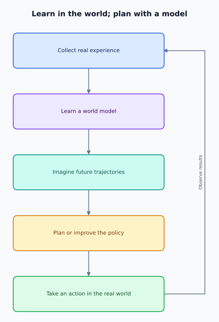
</p>

The attraction is data efficiency and planning capability. The danger is **model error**: planning can exploit inaccuracies in the learned model.


### Planning with a learned simulator

**Analogy:** practice deliveries inside a simulator before spending battery on real roads. A Dyna-style learner combines updates from real transitions with updates from simulated transitions. Model predictive control instead plans a short action sequence, executes its first action, observes the real outcome, and replans.

<p align="center">
  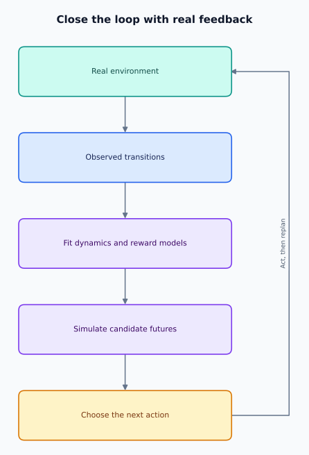
</p>

Errors compound over long imagined trajectories. A planner may discover actions that look excellent in the model but fail in reality. Shorter planning horizons, frequent replanning, and model uncertainty estimates can help. A world model can predict latent representations rather than raw pixels; model-based RL is defined by using predicted dynamics for planning or learning.

---

<a id="topic-35"></a>

## 35. Multi-Agent Reinforcement Learning

Many environments contain multiple learning agents.

Agent i may have policy

<p align="center">
  
</p>

while rewards can be cooperative, competitive, or mixed.

Challenges include:

- non-stationarity because other agents are learning too;
- credit assignment;
- communication;
- coordination;
- partial observability;
- equilibrium behavior.

Multi-agent RL provides useful conceptual tools for systems where multiple autonomous AI agents cooperate or compete, although practical LLM multi-agent systems are not automatically MARL systems unless learning through interaction is actually involved.


### When everyone else's behavior changes

Two delivery robots sharing a narrow corridor may cooperate to finish quickly, compete for priority, or receive a mix of individual and team rewards. From one robot's viewpoint, transitions depend on the other robot's actions. If the other robot is learning, that effective environment changes over training.

**Analogy:** learning to play doubles while your partner is also changing their strategy. Good individual actions may require coordination to become good team actions.

In **centralized training with decentralized execution**, training can use joint information while each deployed agent acts using its own observation. Shared rewards create a credit-assignment problem: team success alone does not reveal whose action helped. Multiple scripted or prompted agents exchanging messages are not by themselves an RL training algorithm.

---

<a id="topic-36"></a>

## 36. Reinforcement Learning from Human Feedback

**[Try it in Notebook 07 → Preferences, DPO, and GRPO](notebooks/07_preference_and_grpo.ipynb)**

RLHF aligns a model's behavior with human preferences rather than relying only on next-token prediction.

A classic pipeline is:

<p align="center">
  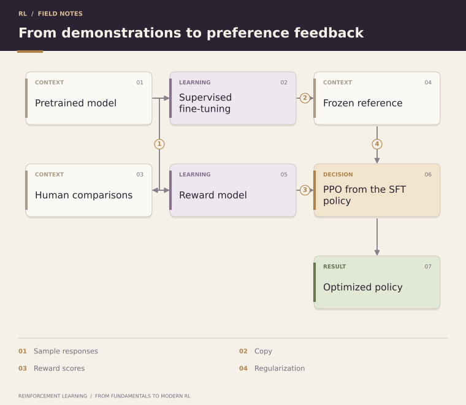
</p>

In one common formulation, a reward model learns from comparisons between responses, and the language-model policy is optimized against that learned reward while being regularized against excessive drift from a reference model.

RLHF connects language-model post-training to classical ideas such as policies, rewards, advantages, value estimation, and constrained updates.


### Map language-model training onto RL

| Classical RL object | Language-model example |
|---|---|
| State or context | Prompt plus tokens generated so far |
| Action | Next token; sometimes a complete response in a simplified formulation |
| Policy | Conditional language-model distribution |
| Episode | One response, or a longer tool interaction |
| Reward | Preference-model score, possibly combined with task feedback |

A common response-level objective is

<p align="center">
  
</p>

The reference is typically a frozen starting policy for the RL stage. It differs from PPO's old policy, which is refreshed as rollout collection proceeds.

**Analogy:** a writer learns from an editor's preferences while retaining useful behavior learned earlier. The result is optimized for measured preferences; a high reward-model score does not establish universal correctness or alignment.

---

<a id="topic-37"></a>

## 37. Reward Models and Preference Learning

**[Try it in Notebook 07 → Preferences, DPO, and GRPO](notebooks/07_preference_and_grpo.ipynb)**

Suppose humans prefer response y<sub>w</sub> over y<sub>l</sub> for prompt x.

A reward model can assign scores

<p align="center">
  
</p>

A common pairwise preference objective models

<p align="center">
  
</p>

The reward model converts qualitative preference comparisons into a scalar signal that can guide optimization.

But reward models are imperfect proxies. Optimizing them too aggressively can expose misspecification, distribution shift, or reward hacking. Evaluation therefore remains a separate and critical part of alignment.


### Train on comparisons, not absolute truth

The sigmoid is σ(z)=1/(1+e<sup>−z</sup>). A pairwise reward-model loss is

<p align="center">
  
</p>

Minimizing it encourages larger score differences in favor of preferred responses. Adding the same prompt-dependent constant to both scores leaves their preference probability unchanged, so these scores are not uniquely calibrated measures of truth.

**Analogy:** asking an editor “which draft is better?” is often easier than asking for a perfectly calibrated numerical quality score. Different editors may disagree, and models can learn superficial cues such as verbosity. Hold out preference examples and separately check task performance to detect failures beyond the training comparisons.

---

<a id="topic-38"></a>

## 38. Direct Preference Optimization

**[Try it in Notebook 07 → Preferences, DPO, and GRPO](notebooks/07_preference_and_grpo.ipynb)**

Direct Preference Optimization (DPO) shows that, under a particular KL-regularized preference-learning formulation, preference optimization can be expressed directly as a classification-style objective without explicitly training a separate reward model and then running an online RL optimizer.

For preferred y<sub>w</sub> and rejected y<sub>l</sub>, DPO favors a larger log-likelihood margin between them, measured relative to a reference policy.

Conceptually:

<p align="center">
  
</p>

DPO is best understood as **preference optimization**, not as a drop-in replacement for every RL problem. It is particularly useful when pairwise preference data are available and online environment interaction is unnecessary.


### The direct objective

Define the reference-relative preference margin

<p align="center">
  
</p>

DPO minimizes −𝔼[log σ(βΔ<sub>θ</sub>)]. Response log probability is the sum of conditional token log probabilities. See the original [DPO paper](https://arxiv.org/abs/2305.18290).

**Analogy:** learn directly from an editor's paired drafts instead of first constructing a separate automated editor. The objective increases the preferred-versus-rejected margin; it does not guarantee that the preferred response's absolute probability rises on every update.

DPO's formulation is connected to KL-regularized reward optimization, but standard training uses fixed preference pairs and requires no online rollout-and-critic loop.

---

<a id="topic-39"></a>

## 39. GRPO and Reinforcement Learning for Reasoning

**[Try it in Notebook 07 → Preferences, DPO, and GRPO](notebooks/07_preference_and_grpo.ipynb)**

Group Relative Policy Optimization (GRPO) is a policy-optimization approach used in modern reasoning-model training. Instead of requiring a separately learned value model for every update, it can estimate relative advantages by comparing rewards among multiple outputs generated for the same prompt.

A simplified intuition is:

<p align="center">
  
</p>

This is attractive for reasoning tasks where many candidate solutions can be sampled and scored using verifiable or learned rewards.

Modern reasoning RL raises deeper questions than simply maximizing final-answer correctness: how should intermediate reasoning, efficiency, exploration, tool use, and robustness be rewarded without teaching the model to exploit the evaluator?

**[Try it in Notebook 07 → Preferences, DPO, and GRPO](notebooks/07_preference_and_grpo.ipynb)**


### A group-relative advantage example

For sampled responses with rewards [0,1,1,0], the mean is 0.5 and population standard deviation is 0.5. The normalized sequence-level signals are approximately [−1,+1,+1,−1]:

<p align="center">
  
</p>

**Analogy:** compare several attempts at the same puzzle so that feedback is relative to that puzzle's difficulty. If all rewards are equal, this signal is zero; the group offers no reward-based ranking.

The original [DeepSeekMath paper](https://arxiv.org/abs/2402.03300) combines group-relative signals with a clipped policy objective and reference-policy regularization, avoiding a separately trained value model. Normalization alone is not the full algorithm. Variants differ in token weighting and normalization.

With outcome rewards, the same response-level signal can weight multiple token decisions. This does not identify which intermediate step caused success. Verifiable rewards, such as passing tests, reduce dependence on subjective scoring but still depend on evaluator quality.

---

<a id="topic-40"></a>

## 40. Multimodal RL and RL for AI Agents

Sequential optimization also extends beyond text-only responses.

A multimodal policy may condition on

<p align="center">
  
</p>

and choose actions such as

<p align="center">
  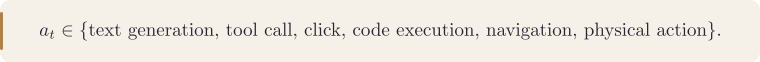
</p>

This creates several research challenges.

### Multimodal credit assignment

If a model succeeds, which visual observation, reasoning step, textual decision, or tool action deserves credit?

### Long-horizon agent rewards

A useful agent may execute dozens of steps before task success can be evaluated. Sparse final rewards make learning difficult.

### Tool-use policies

The model must learn not only **how** to call a tool, but **when**, **which tool**, and whether another observation is needed before acting.

### Process vs outcome rewards

Outcome reward evaluates the final result. Process reward evaluates intermediate decisions. Both can help, but both can also encode incorrect incentives.

### Safety and constraints

A high reward does not imply that every path to it is acceptable. Real agents often need constrained action spaces, permission systems, safety policies, and external verification in addition to learned rewards.

A useful conceptual architecture is:

<p align="center">
  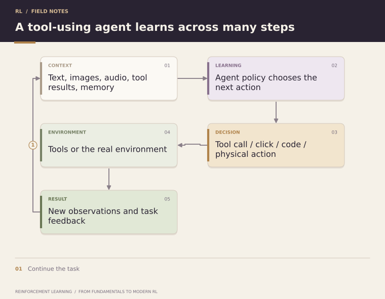
</p>

The core RL problem remains recognizable: **learn which actions produce desirable long-term outcomes**. What changes is the scale and richness of the state, action, feedback, and environment.


### Example: an agent fixes a failing program

The agent observes the task, source files, and test output. It chooses actions such as reading a file, editing code, or running a test. Tool results become new observations. A final reward might combine task completion and execution cost, while action constraints define which operations are permitted.

**Analogy:** a delivery robot uses cameras to understand roads; a coding agent uses file contents and tool output to understand a software workspace. Both must select useful observations and actions before the final outcome is known.

A practical training design must specify episode boundaries, what information the policy sees, how success is checked, and whether feedback arrives per step or only at completion. Merely calling tools at inference time is not RL; RL requires an update process driven by interaction outcomes.

Evaluate successful completion, failures, and cost on held-out tasks. Process rewards can guide intermediate decisions, but a plausible-looking intermediate step is not proof that it improves final outcomes.

---

<a id="algorithm-comparison"></a>

# Algorithm Comparison

| Method | Main thing learned | Data or model needed | Target intuition |
|---|---|---|---|
| Policy/value iteration | Tabular values and greedy policy | Known transition and reward model | Average all modeled outcomes |
| Monte Carlo prediction | V<sup>π</sup> or Q<sup>π</sup> | Episodes from the evaluated policy, or appropriate correction | Complete sampled return |
| TD(0) prediction | V<sup>π</sup> | Transitions under the evaluated policy | Reward plus next-state value |
| SARSA | Action values for the behavior policy | On-policy transitions and next actions | Reward plus chosen next-action value |
| Q-learning | Optimal action values in the tabular setting | Exploratory transitions with sufficient coverage | Reward plus maximum next-action value |
| DQN | Neural action values | Off-policy transitions, usually replay | Detached target-network bootstrap |
| REINFORCE | Policy parameters | On-policy episodes | Return-weighted log probability |
| Actor–critic / PPO | Policy and critic | Typically fresh on-policy rollouts here | Advantage-weighted policy improvement |
| Offline RL | Policy and/or values | Fixed interaction dataset | Improve while handling limited coverage |
| Model-based RL | Model and a planner and/or policy | Known dynamics or experience to learn them | Compare predicted futures |
| PPO-based RLHF | Language policy and critic | Generated responses plus reward feedback | Regularized preference-reward optimization |
| DPO | Language policy | Preference pairs and reference policy | Preferred/rejected likelihood margin |
| GRPO | Language policy | Groups of generated responses and scores | Group-relative policy-update signal |

Offline and model-based RL are broad settings or method families, not single update rules. Likewise, RLHF describes the feedback setup, while PPO specifies an optimization method.

---

<a id="practical-track"></a>

# Practical Track

These seven self-contained notebooks connect the theory to working experiments. Each includes explanations, analogies, diagrams, reproducible code, saved result plots, correctness checks, and exercises with hints. The classical lessons use NumPy; the neural-network lessons use small CPU-only PyTorch models. No datasets, pretrained models, or API keys are needed.

| Notebook | Concepts |
|---|---|
| [01 — MDP and Dynamic Programming](notebooks/01_mdp_dynamic_programming.ipynb) | Grid-world MDP, Bellman equations, policy evaluation, policy iteration, value iteration |
| [02 — Monte Carlo versus TD](notebooks/02_mc_vs_td.ipynb) | Random-walk prediction, first-visit MC, TD(0), bias and variance |
| [03 — SARSA and Q-learning](notebooks/03_q_learning.ipynb) | Cliff walking, on-policy and off-policy learning, epsilon-greedy exploration |
| [04 — DQN](notebooks/04_dqn.ipynb) | Neural Q-values, replay buffer, target network, terminal masking |
| [05 — Policy Gradients](notebooks/05_policy_gradient.ipynb) | REINFORCE, discounted returns, action-independent baselines |
| [06 — PPO](notebooks/06_ppo.ipynb) | Actor–critic, vectorized rollouts, GAE, clipping, KL monitoring |
| [07 — Preferences and GRPO](notebooks/07_preference_and_grpo.ipynb) | Synthetic preferences, reward modeling, DPO, simplified group-relative policy updates |

### Run the notebooks

Use **Python 3.10 or newer**. From the repository root:

```bash
python -m venv .venv
source .venv/bin/activate
python -m pip install -r requirements.txt
python -m ipykernel install --sys-prefix --name python3 --display-name "Python (RL Course)"
jupyter lab
```

On Windows PowerShell, replace the activation command with `.venv\Scripts\Activate.ps1`. Open a notebook and select the **Python (RL Course)** kernel. Choose **Restart Kernel and Run All Cells** to reproduce the experiment from scratch. Work through notebooks 01–07 in order; each also runs independently. GitHub displays the saved outputs without installing anything.

The examples use seeded runs and small environments so they can finish on a CPU. Exact training curves can vary across dependency versions. Notebook 07 uses a finite set of synthetic responses to explain post-training objectives; it does not train a language model.

---

<a id="hands-on-checkpoints"></a>

## Hands-on Checkpoints

| After topics | Task | Check your result |
|---|---|---|
| 1–6 | Compute the return for [−1,−1,10] at γ=0.9 | G<sub>0</sub>=6.2 |
| 7–11 | Average Q-values 8 and 3 under an equal-probability policy | V=5.5; advantages +2.5,−2.5 |
| 12–16 | Define a three-state chain and run value iteration on paper | Terminal value stays zero; reward information moves backward |
| 17–20 | Update V=5 with r=−1, V&#x27;=8, γ=0.9, α=0.1 | TD target 6.2; updated value 5.12 |
| 21–24 | Trace one terminal DQN transition | Target equals r, regardless of next-state network output |
| 25–29 | Compute GAE for residuals [1,2], γ=0.9, λ=0.8 | Final advantage 2; first advantage 2.44 |
| 30–32 | Use PPO ratio 1.4, advantage 2, width 0.2 | Clipped surrogate contribution 2.4 |
| 33–40 | Define a tool agent's observations, actions, episode, and scoring rule | Separate task success from a proxy score and specify missing information |

When extending these notebooks, begin with a tiny environment whose values you can compute by hand. Track episode return, success rate, and episode length; evaluate with fixed parameters on separate episodes and use multiple random seeds before drawing performance conclusions.

---

<a id="suggested-learning-paths"></a>

# Suggested Learning Paths

### Path A — New to RL

Read Topics **1–20** in order, then complete notebooks 1–3 and their exercises.

### Path B — ML Engineer Moving Into Deep RL

Review Topics **3, 7–11, 17–20**, then study **21–32** and complete notebooks 4–6 and their exercises.

### Path C — LLM / Agent Engineer

Build the classical foundation with **3, 5–11, 18–20**, then focus on **25–32 and 36–40**.

Do not skip the classical material: PPO, RLHF, and reasoning RL become much easier to understand once value estimation, advantages, bootstrapping, and policy optimization are clear.

---

<a id="key-equations-cheat-sheet"></a>

# Key Equations Cheat Sheet

### Return

<p align="center">
  
</p>

### State Value

<p align="center">
  
</p>

### Action Value

<p align="center">
  
</p>

### Advantage

<p align="center">
  
</p>

### Bellman Expectation

<p align="center">
  
</p>

### Q-Learning

<p align="center">
  
</p>

### Policy Gradient

<p align="center">
  
</p>

### GAE

<p align="center">
  
</p>

### PPO Ratio

<p align="center">
  
</p>

---

<a id="exercises"></a>

# Exercises

As you work through the course, try answering these without looking at the previous sections:

1. Why is reward different from value?
2. What information must a state contain for the Markov assumption to be reasonable?
3. Why can V(s) be high even when one particular action in that state is bad?
4. What does bootstrapping mean in RL?
5. Why is SARSA on-policy while Q-learning is off-policy?
6. Why can neural-network function approximation destabilize value learning?
7. Why do DQN's replay buffer and target network help?
8. Why does subtracting a baseline help policy gradients?
9. What problem is GAE trying to solve?
10. Why does PPO constrain policy movement?
11. What makes offline RL harder than supervised learning on the same dataset?
12. Why can a learned reward model be exploited?
13. In what sense is DPO different from PPO-based RLHF?
14. Why are group-relative rewards useful for reasoning tasks?
15. How would you define state, action, reward, and episode for a tool-using AI agent?

---

<a id="recommended-references"></a>

# Recommended References

The course is designed to stand on its own, but these works are excellent deeper references:

- Richard S. Sutton and Andrew G. Barto — *Reinforcement Learning: An Introduction*, 2nd ed.
- David Silver — *Reinforcement Learning* lecture series.
- Mnih et al. — *Human-level control through deep reinforcement learning*.
- Williams — *Simple Statistical Gradient-Following Algorithms for Connectionist Reinforcement Learning*.
- Schulman et al. — *High-Dimensional Continuous Control Using Generalized Advantage Estimation*.
- Schulman et al. — *Trust Region Policy Optimization*.
- Schulman et al. — [*Proximal Policy Optimization Algorithms*](https://arxiv.org/abs/1707.06347).
- Ouyang et al. — *Training language models to follow instructions with human feedback*.
- Rafailov et al. — [*Direct Preference Optimization: Your Language Model is Secretly a Reward Model*](https://arxiv.org/abs/2305.18290).
- Shao et al. — [*DeepSeekMath: Pushing the Limits of Mathematical Reasoning in Open Language Models*](https://arxiv.org/abs/2402.03300), introducing GRPO.

For fast-moving topics such as reasoning RL and GRPO, prefer the original model reports/papers and current implementations because terminology and training recipes continue to evolve.

---

<a id="repository-structure"></a>

# Repository Structure

The repository includes seven executable notebooks with saved outputs and setup dependencies. Exercises appear in this README and inside each notebook. Rendered diagrams and equations are included so the course displays without running generation tools.

```text
reinforcement-learning-course/
│
├── README.md
├── notebooks/
│   ├── 01_mdp_dynamic_programming.ipynb
│   ├── 02_mc_vs_td.ipynb
│   ├── 03_q_learning.ipynb
│   ├── 04_dqn.ipynb
│   ├── 05_policy_gradient.ipynb
│   ├── 06_ppo.ipynb
│   └── 07_preference_and_grpo.ipynb
│
├── assets/
│   ├── course-banner.png
│   ├── diagrams/             # Rendered SVG diagrams
│   └── equations/            # Rendered SVG equations
│
├── requirements.txt
└── LICENSE
```

---

<a id="course-design-principles"></a>

# Course Design Principles

**1. Intuition before notation.** Equations are easier when the underlying decision problem is clear.

**2. Classical RL before modern post-training.** Modern methods make more sense when Bellman equations, TD learning, advantages, and policy gradients are understood first.

**3. Implementation only where it teaches something.** The practical track uses a small number of focused notebooks rather than turning every concept into repetitive code.

**4. Connect theory to current AI systems.** RL is presented not only as game-playing theory but as a foundation for reasoning models, preference optimization, multimodal systems, and agents.

**5. Distinguish established ideas from evolving practice.** Classical algorithms have stable definitions; modern LLM post-training terminology and recipes evolve quickly and should be read alongside primary sources.

---

<a id="contributing"></a>

## Contributing

Corrections, examples, implementation improvements, and suggestions for additional references are welcome through issues and pull requests.

<a id="license"></a>

## License

This course uses separate licenses for educational content and code:

| Material | License |
|---|---|
| README, explanatory documentation, notebook Markdown cells, diagrams, equations, banner, images, and other non-code assets (including saved plots) | [CC BY 4.0](LICENSE-CC-BY-4.0) |
| Source code, notebook code cells, and code examples in documentation | [MIT](LICENSE-MIT) |

For content reuse, credit **shivam bharadwaj**, link to this repository and the [CC BY 4.0 license](https://creativecommons.org/licenses/by/4.0/), and indicate any changes. See [LICENSE](LICENSE) for the scope of each license. Separately identified third-party material retains its own license.

---

### About This Course

This course is intended as a compact bridge between **classical reinforcement learning and modern AI post-training**—starting from the agent–environment loop and ending with reasoning, multimodal policies, and tool-using agents.
