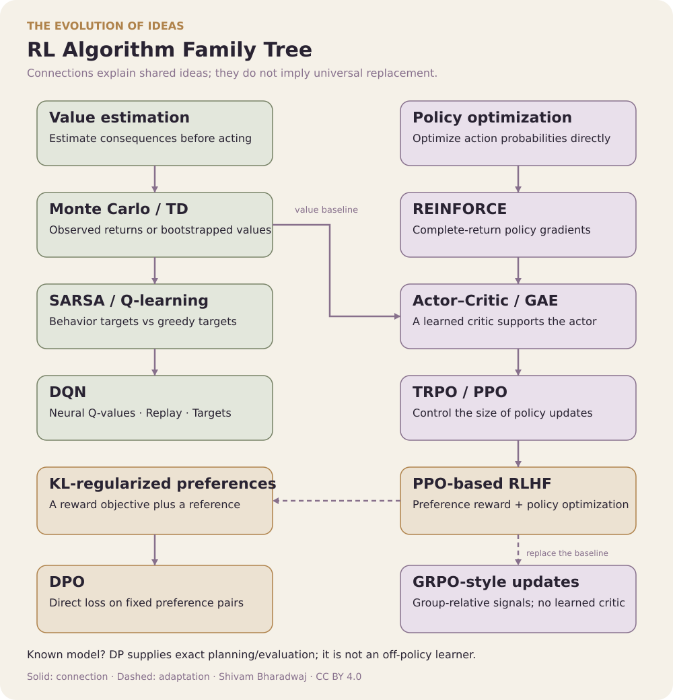

# From Bellman Equations to Reasoning Agents

**48 topics • 14 notebooks • Classical RL → Inference-Time Reasoning**

*A systems-oriented course connecting classical reinforcement learning to modern reasoning models and AI agents.*

**Created by [Shivam Bharadwaj](https://github.com/bshivambharadwaj)**

For the learner who says: **“I know ML and LLMs, but how did we get from Q-learning to PPO, RLHF, and GRPO?”**

Follow **classical RL → deep RL → post-training → agents → inference-time reasoning**. Reuse a delivery-robot intuition, inspect the updates, compare methods on one task, fine-tune a real small language model, train a tool-selection agent, and compare frozen-policy search strategies. The original seven lessons need no model downloads; the optional small-model lab downloads a pinned public checkpoint.

**[Start Learning](quick-read/01-what-is-reinforcement-learning.md) | [Notebooks](#practical-track) | [Advanced RL](#part-ii-advanced-and-modern-reinforcement-learning) | [Exercises](#exercises)**

**Choose your reading depth:** select a topic below for its [quick read](quick-read/README.md), then follow its chapter link for deeper study. All 48 [Chapters](chapters/README.md) include derivations, worked examples, and exercises with answers.

⭐ If this course helps you, star this repo to help others discover it.

> **Course philosophy:** intuition → mathematics → algorithm → implementation → modern connection.

## Contents

- [How to Use This Course](#how-to-use-this-course)
- [Prerequisites](#prerequisites)
- [Course Roadmap](#course-roadmap)
- [Algorithm Family Tree](#algorithm-family-tree)
- [Failure-Mode Track](#failure-mode-track)
- [What Makes This Course Different?](#what-makes-this-course-different)
- [Who This Course Is For](#who-this-course-is-for)
- [What You Will Learn](#what-you-will-learn)
- <a id="part-i-reinforcement-learning-fundamentals"></a> [Part I: Reinforcement Learning Fundamentals](#part-i-reinforcement-learning-fundamentals)
  - <a id="topic-1"></a> [1. What Is Reinforcement Learning?](quick-read/01-what-is-reinforcement-learning.md)
  - <a id="topic-2"></a> [2. The Agent–Environment Interaction](quick-read/02-the-agent-environment-interaction.md)
  - <a id="topic-3"></a> [3. Markov Decision Processes](quick-read/03-markov-decision-processes.md)
  - <a id="topic-4"></a> [4. States, Actions, Rewards and Transitions](quick-read/04-states-actions-rewards-and-transitions.md)
  - <a id="topic-5"></a> [5. Policies](quick-read/05-policies.md)
  - <a id="topic-6"></a> [6. Returns and Discounting](quick-read/06-returns-and-discounting.md)
  - <a id="topic-7"></a> [7. State-Value Functions](quick-read/07-state-value-functions.md)
  - <a id="topic-8"></a> [8. Action-Value Functions](quick-read/08-action-value-functions.md)
  - <a id="topic-9"></a> [9. Advantage Functions](quick-read/09-advantage-functions.md)
  - <a id="topic-10"></a> [10. Bellman Expectation Equations](quick-read/10-bellman-expectation-equations.md)
  - <a id="topic-11"></a> [11. Bellman Optimality Equations](quick-read/11-bellman-optimality-equations.md)
  - <a id="topic-12"></a> [12. Dynamic Programming](quick-read/12-dynamic-programming.md)
  - <a id="topic-13"></a> [13. Policy Evaluation](quick-read/13-policy-evaluation.md)
  - <a id="topic-14"></a> [14. Policy Improvement](quick-read/14-policy-improvement.md)
  - <a id="topic-15"></a> [15. Policy Iteration](quick-read/15-policy-iteration.md)
  - <a id="topic-16"></a> [16. Value Iteration](quick-read/16-value-iteration.md)
  - <a id="topic-17"></a> [17. Monte Carlo Methods](quick-read/17-monte-carlo-methods.md)
  - <a id="topic-18"></a> [18. Temporal-Difference Learning](quick-read/18-temporal-difference-learning.md)
  - <a id="topic-19"></a> [19. SARSA](quick-read/19-sarsa.md)
  - <a id="topic-20"></a> [20. Q-Learning and Exploration](quick-read/20-q-learning-and-exploration.md)
- <a id="part-ii-advanced-and-modern-reinforcement-learning"></a> [Part II: Advanced and Modern Reinforcement Learning](#part-ii-advanced-and-modern-reinforcement-learning)
  - <a id="topic-21"></a> [21. Function Approximation](quick-read/21-function-approximation.md)
  - <a id="topic-22"></a> [22. Deep Q-Networks](quick-read/22-deep-q-networks.md)
  - <a id="topic-23"></a> [23. Experience Replay](quick-read/23-experience-replay.md)
  - <a id="topic-24"></a> [24. Target Networks](quick-read/24-target-networks.md)
  - <a id="topic-25"></a> [25. Policy Gradient Methods](quick-read/25-policy-gradient-methods.md)
  - <a id="topic-26"></a> [26. REINFORCE](quick-read/26-reinforce.md)
  - <a id="topic-27"></a> [27. Actor–Critic Methods](quick-read/27-actor-critic-methods.md)
  - <a id="topic-28"></a> [28. Advantage Actor–Critic](quick-read/28-advantage-actor-critic.md)
  - <a id="topic-29"></a> [29. Generalized Advantage Estimation](quick-read/29-generalized-advantage-estimation.md)
  - <a id="topic-30"></a> [30. Trust Region Policy Optimization](quick-read/30-trust-region-policy-optimization.md)
  - <a id="topic-31"></a> [31. Proximal Policy Optimization](quick-read/31-proximal-policy-optimization.md)
  - <a id="topic-32"></a> [32. Entropy Regularization](quick-read/32-entropy-regularization.md)
  - <a id="topic-33"></a> [33. Offline Reinforcement Learning](quick-read/33-offline-reinforcement-learning.md)
  - <a id="topic-34"></a> [34. Model-Based Reinforcement Learning](quick-read/34-model-based-reinforcement-learning.md)
  - <a id="topic-35"></a> [35. Multi-Agent Reinforcement Learning](quick-read/35-multi-agent-reinforcement-learning.md)
  - <a id="topic-36"></a> [36. Reinforcement Learning from Human Feedback](quick-read/36-reinforcement-learning-from-human-feedback.md)
  - <a id="topic-37"></a> [37. Reward Models and Preference Learning](quick-read/37-reward-models-and-preference-learning.md)
  - <a id="topic-38"></a> [38. Direct Preference Optimization](quick-read/38-direct-preference-optimization.md)
  - <a id="topic-39"></a> [39. GRPO and Reinforcement Learning for Reasoning](quick-read/39-grpo-and-reinforcement-learning-for-reasoning.md)
  - <a id="topic-40"></a> [40. Multimodal RL and RL for AI Agents](quick-read/40-multimodal-rl-and-rl-for-ai-agents.md)
- <a id="part-iii-inference-time-reasoning-and-planning"></a> [Part III: Inference-Time Reasoning and Planning](#inference-time-practical-track)
  - <a id="topic-41"></a> [41. From Policy Learning to Inference-Time Planning](quick-read/41-from-policy-learning-to-inference-time-planning.md)
  - <a id="topic-42"></a> [42. Reasoning as a Sequential Decision Problem](quick-read/42-reasoning-as-a-sequential-decision-problem.md)
  - <a id="topic-43"></a> [43. Sampling and Candidate Selection](quick-read/43-sampling-and-candidate-selection.md)
  - <a id="topic-44"></a> [44. Verifiers, Process Rewards, and Value Models](quick-read/44-verifiers-process-rewards-and-value-models.md)
  - <a id="topic-45"></a> [45. Search over Reasoning Trajectories](quick-read/45-search-over-reasoning-trajectories.md)
  - <a id="topic-46"></a> [46. Budget-Aware Reasoning](quick-read/46-budget-aware-reasoning.md)
  - <a id="topic-47"></a> [47. Learning from Search](quick-read/47-learning-from-search.md)
  - <a id="topic-48"></a> [48. Evaluating Inference-Time Reasoning](quick-read/48-evaluating-inference-time-reasoning.md)
- [Algorithm Comparison](#algorithm-comparison)
- [Practical Track](#practical-track)
- [Hands-on Checkpoints](#hands-on-checkpoints)
- [Suggested Learning Paths](#suggested-learning-paths)
- [Key Equations Cheat Sheet](#key-equations-cheat-sheet)
- [Exercises](#exercises)
- [Recommended References](#recommended-references)
- [Repository Structure](#repository-structure)
- [Course Design Principles](#course-design-principles)
- [Contributing](#contributing)
- [License](#license)

---

<a id="how-to-use-this-course"></a>

## How to Use This Course

Read each topic in this order: intuition, equation, worked example, then algorithm. Keep asking: **what is observed, what is learned, and what target drives the update?** You do not need to memorize every equation on the first pass.

Use this page to navigate. Each topic opens a quick read with the original explanation, equations, and diagrams, followed by a link to its expanded chapter. Follow the **Try it in Notebook** links for runnable experiments. Each notebook includes saved results, correctness checks, and exercises with hints.

<a id="prerequisites"></a>

### Prerequisites

- **Python:** functions, loops, arrays, and basic NumPy.
- **Calculus:** derivatives, partial derivatives, and the chain rule.
- **Probability:** expectations, conditional probability, and sampling.
- **Linear algebra:** vectors, matrices, and dot products.

You do not need previous RL experience. Basic neural-network and gradient-descent knowledge will help from Topic 21 onward. Difficulty labels below describe the progression within this course.

**Visual guide:** these course notes use ink-plum, antique gold, sage, and warm paper. Each diagram labels context, decisions, learning, and results; small numbered arrows refer to the notes below the chart.

### Running Example: A Delivery Robot

A robot carries a parcel through a small town. Each ordinary move costs −1, successful delivery gives +10 on the final transition, and delivery ends the episode. Some examples add traffic, battery constraints, or failure penalties explicitly. This setting lets us reuse one intuition across many algorithms.

<p align="center">
  
</p>

The safe trajectory has rewards [−1,−1,+10]. The shortcut illustrates uncertainty; its probabilities and entry cost must be specified before calculating its expected return. The robot's challenge is to choose actions with good total outcomes, not merely avoid every immediate cost.

### Notation Guide

| Symbol | Meaning |
|---|---|
| S<sub>t</sub>,A<sub>t</sub>,R<sub>t+1</sub> | State, action, and reward received after that action |
| s,a,r,s&#x27; | Concrete sampled transition values |
| π(a&#124;s) | Policy's probability of action a in state s |
| P(s&#x27;&#124;s,a) | Next-state transition probability |
| p(s&#x27;,r&#124;s,a) | Joint next-state and reward probability |
| γ | Discount factor |
| G<sub>t</sub> | Discounted return starting at time t |
| V<sup>π</sup>,Q<sup>π</sup>,A<sup>π</sup> | State value, action value, and advantage under π |
| α | Learning rate: how far an estimate moves toward a target |
| θ,w,φ | Learned parameters of policies, values, or reward models |
| λ | Trace parameter used in GAE and related estimators |
| ε | Exploration probability or PPO clipping width, depending on section |
| d | True-termination indicator: one if no future task reward remains |
| 𝔼,∇,arg max  | Expectation, gradient, and an input attaining the maximum |

Uppercase letters denote random variables; lowercase letters usually denote observed values. PPO's r<sub>t</sub>(θ) is a **probability ratio**, not the environment reward R<sub>t+1</sub>. Terminal bootstrap values are zero; simplified equations that omit a termination mask rely on this convention.

<a id="course-roadmap"></a>

## Course Roadmap

**Foundations → Value Methods → Deep RL → Policy Optimization → Preference Learning → Reasoning RL → Agents**

<p align="center">
  
</p>

| Stage | Difficulty | Learning progression | Practice |
|---|---|---|---|
| [Foundations · 1–11](quick-read/01-what-is-reinforcement-learning.md) | Beginner | Define the decision problem, then connect rewards, returns, values, and Bellman equations. | Trace a small MDP in Notebook 01. |
| [Value-Based RL · 12–20](quick-read/12-dynamic-programming.md) | Beginner → Intermediate | First plan with a known model; then learn values from sampled experience using MC, TD, SARSA, and Q-learning. | Notebooks 01–03. |
| [Deep RL · 21–24](quick-read/21-function-approximation.md) | Intermediate | Replace a Q-table with a network and learn why replay and target networks matter. | Notebook 04. |
| [Policy Optimization · 25–32](quick-read/25-policy-gradient-methods.md) | Intermediate → Advanced | Optimize action probabilities directly, then add baselines, a critic, GAE, and PPO clipping. | Notebooks 05–06. |
| [RLHF and Preferences · 36–38](quick-read/36-reinforcement-learning-from-human-feedback.md) | Advanced | Replace a hand-written reward with preference feedback; distinguish reward modeling, PPO-based RLHF, and DPO. | Notebooks 07 and 09: synthetic objectives and real small-model SFT/DPO. |
| [Reasoning RL · 39](quick-read/39-grpo-and-reinforcement-learning-for-reasoning.md) | Advanced | Generate candidate trajectories, verify outcomes, and inspect group-relative credit. | Notebook 10: two-step reasoning and GRPO-style updates. |
| [Agents and Multimodal RL · 40](quick-read/40-multimodal-rl-and-rl-for-ai-agents.md) | Advanced | Specify tool observations, delayed feedback, constraints, and independent evaluation. | Notebook 11: a learned tool-selection agent and evaluator-gaming capstone. |
| [Inference-Time Reasoning · 41–48](quick-read/41-from-policy-learning-to-inference-time-planning.md) | Advanced | Separate proposals, verifiers, values, search, and compute allocation. | Notebooks 12–14 and an interactive five-strategy demo. |

After policy optimization, read **[Topics 33–35](quick-read/33-offline-reinforcement-learning.md)** as a bridge: offline data changes what you can learn from, world models change how you plan, and multiple agents change whose behavior affects the environment. Then continue to preference learning and reasoning.

Before moving on, explain the current method's **data source, update target, and evaluation rule** without looking at the notes. The modern lessons build on these same choices. Notebook 08 compares algorithms on one environment. Notebook 07 isolates preference objectives; Notebook 09 trains a real pretrained model; Notebook 10 isolates reasoning credit assignment; Notebook 11 closes the loop with tools.

<a id="what-makes-this-course-different"></a>

### What Makes This Course Different?

- **One connected progression:** Bellman equations lead into deep RL, PPO, LLM alignment, DPO, and GRPO.
- **Intuition you can test:** analogies and worked examples connect to fourteen notebooks with saved plots, result tables, and seeded experiments.
- **Modern systems in context:** reasoning, multimodal RL, and agents build on the classical foundations, with explicit distinctions between a pretrained-model lab, structured reasoning experiments, and open research problems.

<a id="algorithm-family-tree"></a>

## Algorithm Family Tree

<p align="center">
  
</p>

Read arrows as **conceptual connections**, not a complete historical genealogy or claims that one method always replaces another. Value estimates support both greedy action selection and policy-gradient baselines. Actor–critic combines a policy with a learned evaluator; TRPO and PPO address update size. RLHF names a feedback setup, not a single optimizer. GRPO-style methods can replace a learned value baseline with within-group comparisons in suitable tasks. DPO takes a separate route from KL-regularized reward optimization to a fixed-pair preference loss.

**Knowledge check:** is PPO “the next version of Q-learning”? No. Both seek better decisions, but one learns a policy through a surrogate objective and the other learns action values through a greedy bootstrap target. Their ideas connect through shared values, sampling, and policy improvement.

<a id="failure-mode-track"></a>

## Failure-Mode Track

Treat each failure as a testable hypothesis. Track task success separately from the quantity being optimized.

| Failure | Where to study it | What to inspect |
|---|---|---|
| Sparse rewards | [Returns](quick-read/06-returns-and-discounting.md), [reasoning lab](notebooks/10_verifiable_reasoning_grpo.ipynb) | Successful samples and tied-group rate before trusting an optimizer |
| Maximization bias | [Q-learning](quick-read/20-q-learning-and-exploration.md) | Noisy action estimates; compare selection and evaluation with separate estimators |
| Deadly triad and unstable bootstrapping | [Function approximation](quick-read/21-function-approximation.md), [target networks](quick-read/24-target-networks.md) | Q-value scale, TD loss, target drift, and actual return |
| Distribution shift | [Offline RL](quick-read/33-offline-reinforcement-learning.md), [small-model lab](notebooks/09_small_model_sft_dpo.ipynb) | Support in training data; test prompts and task splits |
| Policy collapse | [PPO](quick-read/31-proximal-policy-optimization.md), [entropy](quick-read/32-entropy-regularization.md) | Entropy, KL, and return after each update |
| Reward hacking and overoptimization | [Reward models](quick-read/37-reward-models-and-preference-learning.md), [agent capstone](notebooks/11_tool_agent_capstone.ipynb) | Proxy reward versus an independent success checker |
| Reasoning length artifacts | [GRPO](quick-read/39-grpo-and-reinforcement-learning-for-reasoning.md) | Reward by length; token/sequence normalization; fixed-budget comparisons |
| Evaluator gaming | [Agents](quick-read/40-multimodal-rl-and-rl-for-ai-agents.md), [capstone](notebooks/11_tool_agent_capstone.ipynb) | Adversarial outputs, invalid tool calls, and hidden-test success |

<a id="who-this-course-is-for"></a>

## Who This Course Is For

This course is designed for engineers, researchers, and students who already know basic Python and machine learning and want to understand both classical RL and the ideas behind modern post-training and agentic AI systems.

<a id="what-you-will-learn"></a>

## What You Will Learn

By the end of the course, you should be able to:

- formulate sequential decision problems as MDPs;
- understand policies, returns, value functions, Q-functions, and advantages;
- derive and interpret Bellman equations;
- implement dynamic programming, Monte Carlo, TD, SARSA, and Q-learning;
- understand why function approximation changes the RL problem;
- explain DQN, policy gradients, actor–critic methods, GAE, TRPO, and PPO;
- understand offline RL, model-based RL, and multi-agent RL;
- connect classical RL to RLHF, preference optimization, GRPO, reasoning models, multimodal models, and agents.

---

<a id="algorithm-comparison"></a>

# Algorithm Comparison

| Method | Main thing learned | Data or model needed | Target intuition |
|---|---|---|---|
| Policy/value iteration | Tabular values and greedy policy | Known transition and reward model | Average all modeled outcomes |
| Monte Carlo prediction | V<sup>π</sup> or Q<sup>π</sup> | Episodes from the evaluated policy, or appropriate correction | Complete sampled return |
| TD(0) prediction | V<sup>π</sup> | Transitions under the evaluated policy | Reward plus next-state value |
| SARSA | Action values for the behavior policy | On-policy transitions and next actions | Reward plus chosen next-action value |
| Q-learning | Optimal action values in the tabular setting | Exploratory transitions with sufficient coverage | Reward plus maximum next-action value |
| DQN | Neural action values | Off-policy transitions, usually replay | Detached target-network bootstrap |
| REINFORCE | Policy parameters | On-policy episodes | Return-weighted log probability |
| Actor–critic / PPO | Policy and critic | Typically fresh on-policy rollouts here | Advantage-weighted policy improvement |
| Offline RL | Policy and/or values | Fixed interaction dataset | Improve while handling limited coverage |
| Model-based RL | Model and a planner and/or policy | Known dynamics or experience to learn them | Compare predicted futures |
| PPO-based RLHF | Language policy and critic | Generated responses plus reward feedback | Regularized preference-reward optimization |
| DPO | Language policy | Preference pairs and reference policy | Preferred/rejected likelihood margin |
| GRPO | Language policy | Groups of generated responses and scores | Group-relative policy-update signal |

Offline and model-based RL are broad settings or method families, not single update rules. Likewise, RLHF describes the feedback setup, while PPO specifies an optimization method.

---

<a id="practical-track"></a>

# Practical Track

The **seven core notebooks** build the fundamentals with NumPy and small CPU PyTorch experiments.
**Four integrated labs** add algorithm comparisons, real small-model post-training, verified reasoning,
and a tool-agent capstone. **Three Part III labs** cover inference-time selection, search, and learning from search. Each links to theory, documents its experiment, and includes saved outputs.
Notebook 09 requires a public pretrained-model download and the optional modern dependencies; the
other thirteen use generated environments/data and need no model downloads or API keys.

| Notebook | Concepts |
|---|---|
| [01 — MDP and Dynamic Programming](notebooks/01_mdp_dynamic_programming.ipynb) | Grid-world MDP, Bellman equations, policy evaluation, policy iteration, value iteration |
| [02 — Monte Carlo versus TD](notebooks/02_mc_vs_td.ipynb) | Random-walk prediction, first-visit MC, TD(0), bias and variance |
| [03 — SARSA and Q-learning](notebooks/03_q_learning.ipynb) | Cliff walking, on-policy and off-policy learning, epsilon-greedy exploration |
| [04 — DQN](notebooks/04_dqn.ipynb) | Neural Q-values, replay buffer, target network, terminal masking |
| [05 — Policy Gradients](notebooks/05_policy_gradient.ipynb) | REINFORCE, discounted returns, action-independent baselines |
| [06 — PPO](notebooks/06_ppo.ipynb) | Actor–critic, vectorized rollouts, GAE, clipping, KL monitoring |
| [07 — Preferences and GRPO](notebooks/07_preference_and_grpo.ipynb) | Synthetic preferences, reward modeling, DPO, simplified group-relative policy updates |
| [08 — One Problem, Many Algorithms](notebooks/08_one_problem_many_algorithms.ipynb) | DP, MC/TD prediction, MC control, SARSA, Q-learning, DQN, REINFORCE, actor-critic, PPO; equal-budget comparisons |
| [09 — Small-Model SFT → DPO](notebooks/09_small_model_sft_dpo.ipynb) | Real SmolLM2-135M, completion masking, cached SFT reference, synthetic preferences, held-out generation |
| [10 — Verifiable Reasoning and GRPO](notebooks/10_verifiable_reasoning_grpo.ipynb) | Two-step neural reasoning policy, grouped candidates, outcome/process feedback, evaluator attack |
| [11 — Tool-Agent Capstone](notebooks/11_tool_agent_capstone.ipynb) | Learned tool routing, potential shaping, held-out operands, reward gaming versus verified success |
| [12: Sampling and Selection](notebooks/12_sampling_and_selection.ipynb) | Frozen policy, best-of-N, self-consistency, oracle candidate success, scorer exploitation |
| [13: Budgeted Reasoning Search](notebooks/13_budgeted_reasoning_search.ipynb) | Sampled beam and best-first search, trace inspection, scoring cost, completion and correctness |
| [14: Learning from Search](notebooks/14_learning_from_search.ipynb) | Teacher search, outcome/process filtering, categorical imitation, held-out student evaluation |

The integrated labs share readable implementations under [`rl_course/`](rl_course/). This is learner-facing
algorithm code, not an authoring tool. Keep the whole repository when running these notebooks.

### Run the notebooks

Use **Python 3.10 or newer**. From the repository root:

```bash
python -m venv .venv
source .venv/bin/activate
python -m pip install -r requirements.txt
python -m ipykernel install --sys-prefix --name python3 --display-name "Python (RL Course)"
jupyter lab
```

On Windows PowerShell, replace the activation command with `.venv\Scripts\Activate.ps1`. Open a notebook and select the **Python (RL Course)** kernel. Choose **Restart Kernel and Run All Cells** to reproduce the experiment from scratch. Start with notebooks 01–07, then choose integrated labs 08–11 and Part III labs 12–14. Each runs independently from the full repository. GitHub displays the saved outputs without installing anything.

For the real small-model lab, also run `python -m pip install -r requirements-modern.txt`.
It uses a pinned model revision and trains only its final decoder layer and normalization. Allow
several GB of RAM and disk/cache space for the model and dependencies. Model downloading needs
internet access on the first run. The lab prints actual training time; other machines may differ.

**Colab:** use the badges below or inside each notebook. Core lessons use Colab's scientific Python
packages; integrated labs clone the repository, and Notebook 09 installs its optional dependencies.
All defaults use CPU. Colab links use the published `main` branch, so local changes must be pushed
before they appear there. See [REPRODUCIBILITY.md](REPRODUCIBILITY.md) for checks, versions, and interpretation.

| Notebook | Run in browser |
|---|---|
| 01 | [](https://colab.research.google.com/github/bshivambharadwaj/Reinforcement-Learning-Course/blob/main/notebooks/01_mdp_dynamic_programming.ipynb) |
| 02 | [](https://colab.research.google.com/github/bshivambharadwaj/Reinforcement-Learning-Course/blob/main/notebooks/02_mc_vs_td.ipynb) |
| 03 | [](https://colab.research.google.com/github/bshivambharadwaj/Reinforcement-Learning-Course/blob/main/notebooks/03_q_learning.ipynb) |
| 04 | [](https://colab.research.google.com/github/bshivambharadwaj/Reinforcement-Learning-Course/blob/main/notebooks/04_dqn.ipynb) |
| 05 | [](https://colab.research.google.com/github/bshivambharadwaj/Reinforcement-Learning-Course/blob/main/notebooks/05_policy_gradient.ipynb) |
| 06 | [](https://colab.research.google.com/github/bshivambharadwaj/Reinforcement-Learning-Course/blob/main/notebooks/06_ppo.ipynb) |
| 07 | [](https://colab.research.google.com/github/bshivambharadwaj/Reinforcement-Learning-Course/blob/main/notebooks/07_preference_and_grpo.ipynb) |
| 08 | [](https://colab.research.google.com/github/bshivambharadwaj/Reinforcement-Learning-Course/blob/main/notebooks/08_one_problem_many_algorithms.ipynb) |
| 09 | [](https://colab.research.google.com/github/bshivambharadwaj/Reinforcement-Learning-Course/blob/main/notebooks/09_small_model_sft_dpo.ipynb) |
| 10 | [](https://colab.research.google.com/github/bshivambharadwaj/Reinforcement-Learning-Course/blob/main/notebooks/10_verifiable_reasoning_grpo.ipynb) |
| 11 | [](https://colab.research.google.com/github/bshivambharadwaj/Reinforcement-Learning-Course/blob/main/notebooks/11_tool_agent_capstone.ipynb) |
| 12 | [](https://colab.research.google.com/github/bshivambharadwaj/Reinforcement-Learning-Course/blob/main/notebooks/12_sampling_and_selection.ipynb) |
| 13 | [](https://colab.research.google.com/github/bshivambharadwaj/Reinforcement-Learning-Course/blob/main/notebooks/13_budgeted_reasoning_search.ipynb) |
| 14 | [](https://colab.research.google.com/github/bshivambharadwaj/Reinforcement-Learning-Course/blob/main/notebooks/14_learning_from_search.ipynb) |

---

<a id="inference-time-practical-track"></a>

## Part III practical track

Study [Topics 41–48](quick-read/41-from-policy-learning-to-inference-time-planning.md), then use
Notebooks 12–14 to separate frozen-policy search from a later learning stage. Compare selected
correctness, valid intermediate steps, candidate oracle success, and actual computation.

The [interactive practical demo](demos/inference-time/README.md) compares five strategies and
includes a misleading-scorer experiment. It runs locally without downloads or API keys.
Follow the [Part III exercises and capstone](chapters/PART_III_EXERCISES.md) for written and coding tasks.

```bash
python -m rl_course.inference_demo --output /tmp/rl-inference-demo.html
```

Open the generated HTML in a browser. This is a transparent arithmetic simulator, not an LLM
benchmark; the chapter references explain the connection to real inference-time reasoning systems.

---

<a id="hands-on-checkpoints"></a>

## Hands-on Checkpoints

| After topics | Task | Check your result |
|---|---|---|
| 1–6 | Compute the return for [−1,−1,10] at γ=0.9 | G<sub>0</sub>=6.2 |
| 7–11 | Average Q-values 8 and 3 under an equal-probability policy | V=5.5; advantages +2.5,−2.5 |
| 12–16 | Define a three-state chain and run value iteration on paper | Terminal value stays zero; reward information moves backward |
| 17–20 | Update V=5 with r=−1, V&#x27;=8, γ=0.9, α=0.1 | TD target 6.2; updated value 5.12 |
| 21–24 | Trace one terminal DQN transition | Target equals r, regardless of next-state network output |
| 25–29 | Compute GAE for residuals [1,2], γ=0.9, λ=0.8 | Final advantage 2; first advantage 2.44 |
| 30–32 | Use PPO ratio 1.4, advantage 2, width 0.2 | Clipped surrogate contribution 2.4 |
| 33–40 | Define a tool agent's observations, actions, episode, and scoring rule | Separate task success from a proxy score and specify missing information |

When extending these notebooks, begin with a tiny environment whose values you can compute by hand. Track episode return, success rate, and episode length; evaluate with fixed parameters on separate episodes and use multiple random seeds before drawing performance conclusions.

---

<a id="suggested-learning-paths"></a>

# Suggested Learning Paths

### Path A — New to RL

Read Topics **1–20** in order, then complete notebooks 1–3 and their exercises.

### Path B — ML Engineer Moving Into Deep RL

Review Topics **3, 7–11, 17–20**, then study **21–32** and complete notebooks 4–6 and their exercises.

### Path C — LLM / Agent Engineer

Build the classical foundation with **3, 5–11, 18–20**, then focus on **25–32 and 36–40**.

Do not skip the classical material: PPO, RLHF, and reasoning RL become much easier to understand once value estimation, advantages, bootstrapping, and policy optimization are clear.

---

<a id="key-equations-cheat-sheet"></a>

# Key Equations Cheat Sheet

### Return

<p align="center">
  
</p>

### State Value

<p align="center">
  
</p>

### Action Value

<p align="center">
  
</p>

### Advantage

<p align="center">
  
</p>

### Bellman Expectation

<p align="center">
  
</p>

### Q-Learning

<p align="center">
  
</p>

### Policy Gradient

<p align="center">
  
</p>

### GAE

<p align="center">
  
</p>

### PPO Ratio

<p align="center">
  
</p>

---

<a id="exercises"></a>

# Exercises

As you work through the course, try answering these without looking at the previous sections:

1. Why is reward different from value?
2. What information must a state contain for the Markov assumption to be reasonable?
3. Why can V(s) be high even when one particular action in that state is bad?
4. What does bootstrapping mean in RL?
5. Why is SARSA on-policy while Q-learning is off-policy?
6. Why can neural-network function approximation destabilize value learning?
7. Why do DQN's replay buffer and target network help?
8. Why does subtracting a baseline help policy gradients?
9. What problem is GAE trying to solve?
10. Why does PPO constrain policy movement?
11. What makes offline RL harder than supervised learning on the same dataset?
12. Why can a learned reward model be exploited?
13. In what sense is DPO different from PPO-based RLHF?
14. Why are group-relative rewards useful for reasoning tasks?
15. How would you define state, action, reward, and episode for a tool-using AI agent?

---

<a id="recommended-references"></a>

# Recommended References

The course is designed to stand on its own, but these works are excellent deeper references:

- Richard S. Sutton and Andrew G. Barto — *Reinforcement Learning: An Introduction*, 2nd ed.
- David Silver — *Reinforcement Learning* lecture series.
- Mnih et al. — *Human-level control through deep reinforcement learning*.
- Williams — *Simple Statistical Gradient-Following Algorithms for Connectionist Reinforcement Learning*.
- Schulman et al. — *High-Dimensional Continuous Control Using Generalized Advantage Estimation*.
- Schulman et al. — *Trust Region Policy Optimization*.
- Schulman et al. — [*Proximal Policy Optimization Algorithms*](https://arxiv.org/abs/1707.06347).
- Ouyang et al. — *Training language models to follow instructions with human feedback*.
- Rafailov et al. — [*Direct Preference Optimization: Your Language Model is Secretly a Reward Model*](https://arxiv.org/abs/2305.18290).
- Shao et al. — [*DeepSeekMath: Pushing the Limits of Mathematical Reasoning in Open Language Models*](https://arxiv.org/abs/2402.03300), introducing GRPO.

For fast-moving topics such as reasoning RL and GRPO, prefer the original model reports/papers and current implementations because terminology and training recipes continue to evolve.

---

<a id="repository-structure"></a>

# Repository Structure

The repository includes fourteen executable notebooks with saved outputs, shared lab implementations, and setup dependencies. Exercises appear in this README and inside each notebook. Rendered diagrams and equations are included so the course displays without running generation tools.

```text
reinforcement-learning-course/
│
├── README.md
├── quick-read/               # 48 concise topic pages and their index
├── chapters/                 # 48 chapters, each with ten numbered sections
│   ├── README.md             # Chapter index and learning paths
│   ├── NOTATION.md           # Mathematical conventions and reading guide
│   ├── ASSESSMENT.md         # Problem sets, capstone, and assessment rubric
│   ├── 01-what-is-reinforcement-learning/
│   └── ...                  # One README per chapter, through Chapter 48
├── notebooks/
│   ├── 01_mdp_dynamic_programming.ipynb
│   ├── 02_mc_vs_td.ipynb
│   ├── 03_q_learning.ipynb
│   ├── 04_dqn.ipynb
│   ├── 05_policy_gradient.ipynb
│   ├── 06_ppo.ipynb
│   ├── 07_preference_and_grpo.ipynb
│   ├── 08_one_problem_many_algorithms.ipynb
│   ├── 09_small_model_sft_dpo.ipynb
│   ├── 10_verifiable_reasoning_grpo.ipynb
│   ├── 11_tool_agent_capstone.ipynb
│   ├── 12_sampling_and_selection.ipynb
│   ├── 13_budgeted_reasoning_search.ipynb
│   └── 14_learning_from_search.ipynb
│
├── assets/
│   ├── course-banner.png
│   ├── course-cover.svg
│   ├── course-social-preview.png
│   ├── diagrams/             # Rendered SVG diagrams
│   └── equations/            # Rendered SVG equations
│
├── demos/inference-time/     # Interactive demo, recorded results, and run instructions
├── tests/                    # Inference budget and evaluator invariants
├── rl_course/                # Learner-facing implementations for integrated labs
├── requirements.txt
├── requirements-modern.txt
├── REPRODUCIBILITY.md
├── CONTRIBUTING.md
├── LICENSE
├── LICENSE-MIT
└── LICENSE-CC-BY-4.0
```

---

<a id="course-design-principles"></a>

# Course Design Principles

**1. Intuition before notation.** Equations are easier when the underlying decision problem is clear.

**2. Classical RL before modern post-training.** Modern methods make more sense when Bellman equations, TD learning, advantages, and policy gradients are understood first.

**3. Implementation only where it teaches something.** The practical track uses a small number of focused notebooks rather than turning every concept into repetitive code.

**4. Connect theory to current AI systems.** RL is presented not only as game-playing theory but as a foundation for reasoning models, preference optimization, multimodal systems, and agents.

**5. Distinguish established ideas from evolving practice.** Classical algorithms have stable definitions; modern LLM post-training terminology and recipes evolve quickly and should be read alongside primary sources.

---

<a id="contributing"></a>

## Contributing

Corrections, examples, implementation improvements, and suggestions for additional references are welcome through issues and pull requests. See [CONTRIBUTING.md](CONTRIBUTING.md) for experiment and review expectations.

<a id="license"></a>

## License

This course uses separate licenses for educational content and code:

| Material | License |
|---|---|
| README, explanatory documentation, notebook Markdown cells, diagrams, equations, banner, images, and other non-code assets (including saved plots) | [CC BY 4.0](LICENSE-CC-BY-4.0) |
| Source code, notebook code cells, and code examples in documentation | [MIT](LICENSE-MIT) |

For content reuse, credit **shivam bharadwaj**, link to this repository and the [CC BY 4.0 license](https://creativecommons.org/licenses/by/4.0/), and indicate any changes. See [LICENSE](LICENSE) for the scope of each license. Separately identified third-party material retains its own license.

---

### About This Course

This course is intended as a compact bridge between **classical reinforcement learning and modern AI post-training**—starting from the agent–environment loop and ending with reasoning, multimodal policies, and tool-using agents.
