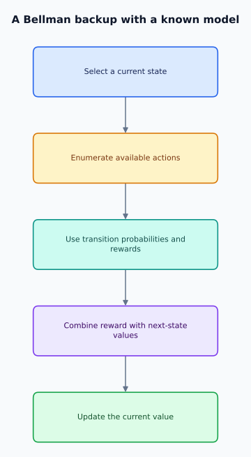

# 12. Dynamic Programming

**Foundations** · **Created by Shivam Bharadwaj**

[← Chapter 11](../11-bellman-optimality-equations/README.md) | [Chapters](../README.md) | [Course home](../../README.md) | [Chapter 13 →](../13-policy-evaluation/README.md)

[Quick-read Topic 12](../../quick-read/12-dynamic-programming.md) · [Notation](../NOTATION.md)

- [12.1 Planning before learning](#section-12-1)
- [12.2 Specify the planning contract](#section-12-2)
- [12.3 Finite horizons require backward induction](#section-12-3)
- [12.4 Calculate a deadline decision](#section-12-4)
- [12.5 Separate the two Bellman operations](#section-12-5)
- [12.6 Account for computational cost](#section-12-6)
- [12.7 Use asynchronous computation carefully](#section-12-7)
- [12.8 Audit the model and the experiment](#section-12-8)
- [12.9 Connect the chapter to the labs](#section-12-9)
- [12.10 Problems, worked answers, and reading](#section-12-10)

---

<p align="center">
  
</p>

*Known-model backups reuse continuation values.*

<a id="section-12-1"></a>

## 12.1 Planning before learning

Dynamic programming (DP) solves a decision problem by reusing solutions to smaller continuation problems. A courier does not enumerate every possible lifetime route independently: it summarizes future consequences at each location using a value. This compression works because the state contains the information needed for the next decision.

**Prerequisites:** Chapters 3 and 10–11. **Targets:** distinguish planning from sampling, implement exact backups, derive their cost, and identify when a model-based answer is not an empirical guarantee.

DP assumes access to a transition and reward model. Learning that model from data introduces an additional estimation problem; the planning algorithm alone does not resolve it.

<a id="section-12-2"></a>

## 12.2 Specify the planning contract

For finite states and actions, store expected immediate rewards r(s,a), transition probabilities P(s'|s,a), legal-action sets, discount gamma, and terminal states. Rows for available actions must sum to one. Treat termination consistently: either mask continuation or use an absorbing zero-reward state.

```text
backup(s,a,v) = r(s,a) + gamma * sum_s' P(s'|s,a) v(s')
```

This formula needs only the expected immediate reward, even when reward and successor are correlated, because expectation is linear. Sampling their joint distribution still matters when simulating trajectories and measuring variance.

<a id="section-12-3"></a>

## 12.3 Finite horizons require backward induction

With H decisions remaining, write V_h(s), where h counts remaining decisions. Set V_0(s)=0 when no terminal payoff exists, then compute V_h(s)=max_a E[r+gamma V_(h−1)(s')]. Work outward from the known boundary.

A state-only policy can be wrong when deadlines matter. With two steps remaining, a detour to charge a battery can be worthwhile; with one, it may waste the last action. Recording h makes the policy Markov again. Finite-horizon DP works with gamma=1 because the recursion stops, whereas discounted fixed-point proofs require gamma<1.

### Prove backward induction by induction on remaining decisions

At h=0, no actions remain, so the boundary value is known. Assume V_(h−1) gives the optimal return for every state with h−1 decisions. Any h-step policy first chooses an action, receives a reward and successor, and then follows an (h−1)-step continuation whose value cannot exceed V_(h−1).

Maximizing the resulting expected backup therefore gives an upper bound on every h-step policy. Choosing an action attaining the maximum and then an optimal (h−1)-step continuation attains that bound. This proves the recursion, including for gamma=1 and finite bounded rewards. It also explains why a policy may depend on remaining time.

<a id="section-12-4"></a>

## 12.4 Calculate a deadline decision

At A, deliver ends with reward 2; charge costs 1 and moves to B. At B, deliver ends with reward 5. Use gamma=0.9.

With one step left, V_1(A)=max(2,−1)=2. With two steps, the charging route is −1+0.9×5=3.5, so V_2(A)=3.5. The same physical location has different optimal actions depending on remaining time.

This is an original miniature version of the course's shared-environment question: how much of apparent algorithm performance comes from having represented the deadline correctly?

<a id="section-12-5"></a>

## 12.5 Separate the two Bellman operations

Policy evaluation averages action backups under a fixed policy. Policy improvement selects actions with larger backups. Policy iteration alternates these operations; value iteration combines a single optimal backup with continued iteration.

```text
known model → evaluate current choices → improve choices → repeat
                            ↓
                  values summarize continuation
```

Monte Carlo and TD replace parts of exact evaluation with samples. This connection explains their targets, but does not transfer every DP convergence argument to approximation and sampling.

<a id="section-12-6"></a>

## 12.6 Account for computational cost

A dense sweep over S states and A actions costs O(S²A), because each action averages over S successors. Dense model storage has the same order. If each action reaches at most K successors, sparse backups cost O(SAK).

Finite-horizon planning takes H backward sweeps. Discounted infinite-horizon iteration has a tolerance-dependent number of sweeps. A neural network can compress the state-value representation, but that does not make exact summation over an enormous transition space free.

### Compute an actual model-storage budget

A dense transition tensor for 10,000 states and four actions has 400 million entries. At eight bytes per float, the transition values alone occupy 3.2 billion bytes, before rewards, indices, and solver workspaces. If each action has at most three successors, there are at most 120,000 nonzero transition entries.

Sparse storage introduces index overhead but can still change feasibility dramatically. The computational advantage depends on whether transitions are actually sparse and whether the implementation exploits that structure. Replacing a table with a network changes representation cost; it does not make unknown transition probabilities available for free.

<a id="section-12-7"></a>

## 12.7 Use asynchronous computation carefully

Synchronous updates read an unchanged old vector. In-place updates immediately reuse new values and therefore depend on sweep order. Both can converge in the finite discounted setting when updates cover all states appropriately, but their intermediate traces differ.

Prioritized sweeping focuses computation where changes are likely to matter. A stopping rule based only on states visited recently can miss large errors elsewhere. Distinguish a full Bellman residual from a local update magnitude in logs and reports.

<a id="section-12-8"></a>

## 12.8 Audit the model and the experiment

Check probability normalization, action legality, boundary values, and an analytically solvable case before benchmarking speed. Then introduce a deliberate model mismatch: change delivery success from 0.9 in planning to 0.6 in evaluation.

An exact optimum of the wrong model may lose to a learned policy trained in the real environment. Report planning compute separately from environment interactions; a DP oracle has information unavailable to a model-free learner and should be labeled accordingly.

### Separate access to a model from access to a simulator

A generative simulator can sample a successor for a queried state-action pair. A full tabular model supplies the complete transition distribution and expected rewards. Computing an exact backup from the first interface generally requires estimating an expectation through samples; from the second, it can sum the supplied probabilities.

When comparing a planner with a sampled learner, state whether arbitrary state resets and model queries are allowed. A robot collecting one continuous stream has less data-access freedom than an algorithm that can repeatedly query any rare state. Counting only ordinary rollout steps can conceal this information advantage.

<a id="section-12-9"></a>

## 12.9 Connect the chapter to the labs

[Notebook 01](../../notebooks/01_mdp_dynamic_programming.ipynb) implements tabular planning. [Notebook 08](../../notebooks/08_one_problem_many_algorithms.ipynb) uses a known-model reference alongside sampled algorithms. First reproduce the reference, then explain the information advantage behind it.

For a reasoning agent, a search tree is a locally constructed model of continuations. Search improves decisions only to the extent that its transitions, scores, and budget reflect actual execution. A larger search is not a substitute for a correct task contract.

<a id="section-12-10"></a>

## 12.10 Problems, worked answers, and reading

1. In the deadline example, what terminal reward at B makes charging tie immediate delivery with two steps left?
2. Estimate successor terms processed by a dense sweep with S=100 and A=4; compare K=3 sparsity.
3. Why can a planner with zero Bellman residual still perform badly after deployment?

<details><summary>Worked answers</summary>

1. Solve −1+0.9b=2, giving b=10/3. The one-step action remains immediate delivery.
2. Dense: 40,000 terms. Sparse: at most 1,200. This comparison excludes indexing overhead and number of sweeps.
3. The residual certifies consistency with the specified model. Wrong transition probabilities, reward specification, or missing state information can invalidate that model's relevance to deployment.

</details>

Read Sutton and Barto, [Chapter 4](http://incompleteideas.net/book/the-book-2nd.html), focusing on the distinction between full backups and sample backups.

---

[← Chapter 11](../11-bellman-optimality-equations/README.md) | [Chapters](../README.md) | [Course home](../../README.md) | [Chapter 13 →](../13-policy-evaluation/README.md)
