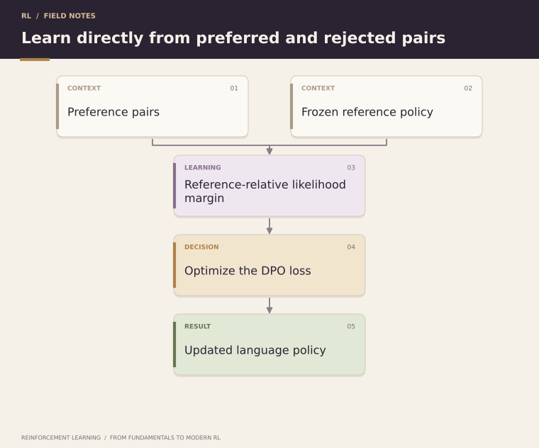

# 38. Direct Preference Optimization

**Advanced** · **Created by Shivam Bharadwaj**

[← Chapter 37](../37-reward-models-and-preference-learning/README.md) | [Chapters](../README.md) | [Course home](../../README.md) | [Chapter 39 →](../39-grpo-and-reinforcement-learning-for-reasoning/README.md)

[Quick-read Topic 38](../../quick-read/38-direct-preference-optimization.md) · [Notation](../NOTATION.md)

- [38.1 Optimize preferences through policy likelihoods](#section-38-1)
- [38.2 Start from the regularized reward problem](#section-38-2)
- [38.3 Cancel the prompt partition function](#section-38-3)
- [38.4 Work a numerical loss](#section-38-4)
- [38.5 Interpret beta without a misleading shortcut](#section-38-5)
- [38.6 Compute response likelihoods correctly](#section-38-6)
- [38.7 Freeze and identify the reference](#section-38-7)
- [38.8 Recognize what a better margin does not prove](#section-38-8)
- [38.9 Laboratory investigation](#section-38-9)
- [38.10 Problems, worked answers, and reading](#section-38-10)

---

<p align="center">
  
</p>

*DPO compares response likelihood margins relative to a reference policy.*

<a id="section-38-1"></a>

## 38.1 Optimize preferences through policy likelihoods

Direct Preference Optimization (DPO) fits a policy to preferred-versus-rejected responses using a reference policy and a pairwise objective. Its derivation connects a KL-regularized reward optimum with an implicit reward expressed through policy log probabilities.

**Prerequisites:** Chapters 32 and 36–37; conditional likelihoods. **Targets:** reconstruct the derivation, calculate a DPO loss, and audit response masking and reference choice.

The courier learns directly which route descriptions should become more likely relative to a familiar baseline, rather than first deploying a separate numerical satisfaction model and then optimizing against it.

<a id="section-38-2"></a>

## 38.2 Start from the regularized reward problem

For each prompt x, consider maximizing E_(y~pi)[r(x,y)]−beta D_KL(pi(.|x)||pi_ref(.|x)), with beta>0 and adequate support. The optimum has form:

```text
pi_star(y|x) = pi_ref(y|x) * exp(r(x,y)/beta) / Z(x)
r(x,y) = beta * log[pi_star(y|x)/pi_ref(y|x)] + beta * log Z(x)
```

This is an idealized distributional relationship. A finite parameterized language model trained on limited preference pairs may not realize the exact optimum.

<a id="section-38-3"></a>

## 38.3 Cancel the prompt partition function

In a pairwise score difference for the same prompt, beta log Z(x) cancels. Substitute the policy log-ratio expression into the preference model from Chapter 37.

Define m=(log pi(y_w|x)−log pi(y_l|x))−(log pi_ref(y_w|x)−log pi_ref(y_l|x)). The DPO loss is −log sigmoid(beta m). This cancellation depends on comparing responses for the same prompt and using the specified preference model.

### Track the gradients of winner and loser likelihoods

Let z=beta[(log pi_w−log pi_l)−(log ref_w−log ref_l)]. The derivative of −log sigmoid(z) with respect to log pi_w is beta(sigmoid(z)−1); the derivative with respect to log pi_l is its negative. Reference terms are fixed.

These derivatives describe pressure on likelihood coordinates. Actual model parameters couple many sequences through normalization and shared representations, so the winner's absolute probability need not increase after a full minibatch update. Distinguish a local loss coefficient from a guaranteed change in every generated response probability.

<a id="section-38-4"></a>

## 38.4 Work a numerical loss

Let policy log probabilities for winner and loser be −2 and −3. Let reference log probabilities be −2.5 and −2.5. Then m=1 and, with beta=0.1, the preference logit is 0.1.

The predicted preference probability is approximately 0.5250 and loss approximately 0.6444. The derivative with respect to m is beta[sigmoid(beta m)−1]≈−0.0475. Gradient descent therefore increases the reference-relative winner margin.

<a id="section-38-5"></a>

## 38.5 Interpret beta without a misleading shortcut

In the regularized reward derivation, beta controls the KL tradeoff for a fixed reward function. In the fitted DPO loss, beta also scales logits and gradients while the implicit reward is being learned through policy parameters.

Consequently “larger beta always means less policy movement in every finite training run” is not a complete empirical rule. Dataset separability, learning rate, epochs, reference, and model capacity all affect the result. Tune on validation evidence and report the actual movement and generated behavior.

<a id="section-38-6"></a>

## 38.6 Compute response likelihoods correctly

For autoregressive models, response log probability is the sum of log probabilities of response tokens conditioned on the prompt and preceding response tokens. Exclude prompt and padding positions; align shifted logits with the intended next-token labels.

State whether EOS is included. Apply the same tokenization, truncation, and mask conventions to policy and reference. A length-normalized average is a different quantity from the sequence log probability used in the basic derivation and must be described as such.

### Trace a masked causal-language-model likelihood

Suppose the token sequence is [prompt_1,prompt_2,response_1,response_2,EOS,pad]. The logit after prompt_2 predicts response_1, the next predicts response_2, and the next predicts EOS. If EOS is included by the stated convention, exactly those three next-token log probabilities contribute to the completion sum.

Prompt prediction and padding positions are excluded. The mask applies to the shifted labels, so using an unshifted attention mask without checking alignment can score the wrong tokens. Validate a tiny hand-constructed sequence before trusting aggregate pair margins. Policy and reference must use identical token boundaries and masking conventions.

<a id="section-38-7"></a>

## 38.7 Freeze and identify the reference

The reference is typically a fixed checkpoint for the optimization stage, often the SFT model. Cache reference log probabilities only when the checkpoint, tokenization, and examples are unchanged.

Using the base model versus the SFT model changes the relative objective. Updating the reference every minibatch changes the method again. Record the exact model revision and which parameters are trainable, especially in a small experiment that trains only part of a network.

<a id="section-38-8"></a>

## 38.8 Recognize what a better margin does not prove

The winner-versus-loser margin can improve because the loser becomes less likely even if the winner's absolute likelihood also falls. Pairwise preference accuracy does not guarantee the model will generate a good response under its actual decoding procedure.

Evaluate generated outputs as well as likelihood metrics. Hold out meaningful prompt or template groups. Check format, correctness, response length, and any task-specific constraints independently of the training pair labels.

### Design a preference-generalization split

When prompts follow templates, randomly splitting response pairs can place nearly identical tasks in both train and test. Split by a meaningful source of novelty, such as template, entity group, or task family, according to the claim you intend to make.

Evaluate winner/loser margins, generated correctness, format compliance, and response length on the same held-out prompts. If margins improve but generated correctness is unchanged, report that narrower result. A post-training stage can alter likelihood structure without producing a measurable gain on a small saturated task.

<a id="section-38-9"></a>

## 38.9 Laboratory investigation

[Notebook 09](../../notebooks/09_small_model_sft_dpo.ipynb) is the direct small-model SFT→DPO lab. Its controlled synthetic task supports inspecting masks, reference log probabilities, held-out margins, and generated accuracy. It is not evidence of broad alignment or open-domain reasoning improvement.

Compare base, SFT, and DPO checkpoints under the same decoding and test prompts. In an extension, deliberately replace summed response log probabilities with a length average, then explain how the objective and length incentives change rather than treating the variant as identical DPO.

<a id="section-38-10"></a>

## 38.10 Problems, worked answers, and reading

1. With m=0 and beta=0.2, calculate loss and derivative with respect to m.
2. A winner's log probability falls from −2 to −3 while a loser's falls from −3 to −5. With fixed reference, did the margin improve?
3. Why does the partition term cancel only in the within-prompt comparison used here?

<details><summary>Worked answers</summary>

1. Loss log 2≈0.6931; derivative 0.2×(0.5−1)=−0.1.
2. Yes: the policy margin rises from 1 to 2, despite the winner becoming less likely in absolute terms. Generation needs separate evaluation.
3. Z depends on x. The same prompt contributes the same additive term to both rewards; different prompts can have different partition terms and do not generally cancel.

</details>

Read [Direct Preference Optimization: Your Language Model is Secretly a Reward Model](https://arxiv.org/abs/2305.18290). Separate the analytical reparameterization from finite-data optimization and deployment claims.

---

[← Chapter 37](../37-reward-models-and-preference-learning/README.md) | [Chapters](../README.md) | [Course home](../../README.md) | [Chapter 39 →](../39-grpo-and-reinforcement-learning-for-reasoning/README.md)
