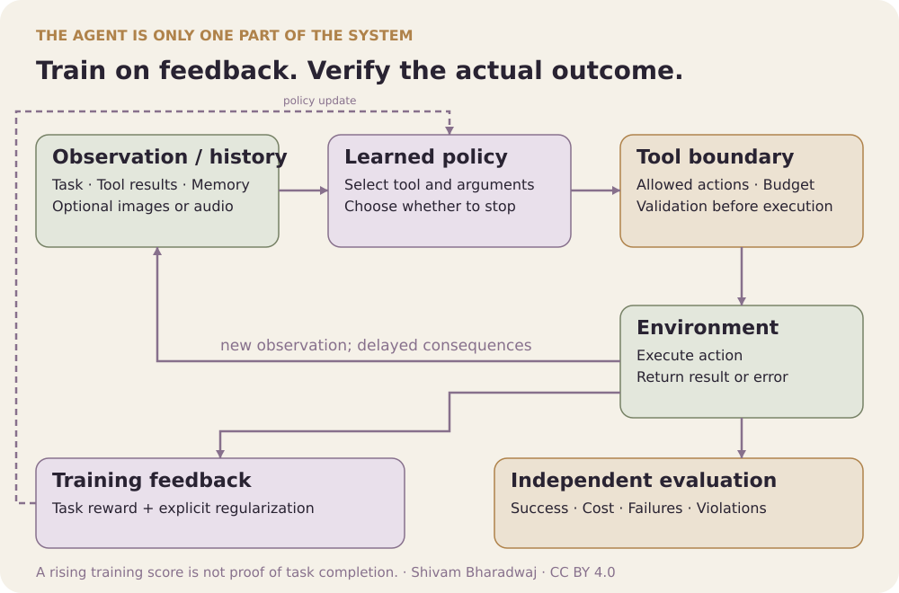

# 40. Multimodal RL and RL for AI Agents

**Advanced** · **Created by Shivam Bharadwaj**

[← Chapter 39](../39-grpo-and-reinforcement-learning-for-reasoning/README.md) | [Chapters](../README.md) | [Course home](../../README.md) | [Capstone →](../../notebooks/11_tool_agent_capstone.ipynb)

[Quick-read Topic 40](../../quick-read/40-multimodal-rl-and-rl-for-ai-agents.md) · [Notation](../NOTATION.md)

- [40.1 Bring perception, reasoning, and action into one task](#section-40-1)
- [40.2 Define the task contract before the policy](#section-40-2)
- [40.3 Model partial observability and memory](#section-40-3)
- [40.4 Explain what multimodality changes](#section-40-4)
- [40.5 Separate training-time learning from inference-time computation](#section-40-5)
- [40.6 Construct rewards that survive agent behavior](#section-40-6)
- [40.7 Work an end-to-end tool episode](#section-40-7)
- [40.8 Evaluate robustness, cost, and constraints](#section-40-8)
- [40.9 Build the capstone from existing laboratories](#section-40-9)
- [40.10 Problems, worked answers, and reading](#section-40-10)

---

<p align="center">
  
</p>

*Verified outcomes are measured from task state rather than agent claims.*

<a id="section-40-1"></a>

## 40.1 Bring perception, reasoning, and action into one task

An AI agent observes a task, chooses actions, receives external feedback, and continues until a stopping condition. Multimodal agents add inputs or outputs such as images, audio, and spatial actions. RL provides a language for objectives and sequential feedback, but a useful system also needs a trustworthy interface and evaluator.

**Prerequisites:** Chapters 2–4, 27–39. **Targets:** formalize a partially observed tool task, separate training and inference-time search, design independent verification, and produce a defensible capstone report.

Return to the courier. Reading a map, interpreting a photograph of a building, calling a dispatch tool, and physically delivering a parcel are different information and action channels. A fluent explanation of the journey is not the delivery itself. This chapter joins the course's mathematical objects to that operational distinction.

<a id="section-40-2"></a>

## 40.2 Define the task contract before the policy

Specify initial-state distribution, observations, legal actions, transition behavior, rewards, success conditions, horizon, resource budget, and constraints. For a tool task, define tool argument schemas, error responses, side effects, and whether operations are reversible or repeatable.

```text
task + external state → observation → policy → validated action
         ↑                                      ↓
  independent evaluator ← tool result ← environment execution
```

The evaluator reads the authoritative task state. Agent messages are observations or proposed claims, not automatic state transitions. A message saying “success” should not create success unless the task explicitly defines that message as the required outcome.

For each action, answer: what can change, how is the change observed, and who can verify it? These questions prevent reward functions that score persuasive reports instead of completed tasks.

<a id="section-40-3"></a>

## 40.3 Model partial observability and memory

The agent usually sees an observation o_t rather than the full environment state s_t. A policy may condition on history h_t=(o_0,a_0,…,o_t), or on a learned memory representation. A belief state is a probability distribution over hidden states conditioned on that history and a model.

Two identical screenshots can represent different hidden backend states. Two tool responses can omit information about prior writes. If the policy input discards this distinction, no amount of training can make the observation alone fully informative.

Memory should preserve task-relevant evidence, not merely accumulate text. Record which facts came from tools, which are hypotheses, and whether later observations supersede earlier ones. A summary can reduce context cost while losing a critical constraint; evaluate that failure explicitly.

### Calculate the value of a noisy observation

Suppose an agent must choose between two tools, each correct in one of two equally likely hidden states. Without information, its best success probability is 0.5. A sensor identifies the hidden state correctly with probability 0.8 and costs 0.1 reward; correct execution pays 1 and failure pays 0, with gamma=1.

Using the sensor and following its indication yields expected reward 0.8−0.1=0.7, better than 0.5. If the sensor cost exceeds 0.3, that strategy is no longer preferable under this objective. Information-gathering actions can thus be evaluated using the same return accounting as ordinary actions.

With a different prior, apply Bayes' rule before choosing. A noisy indication need not overturn a sufficiently strong prior belief. Treating every observation as certain evidence can produce worse decisions than explicitly representing uncertainty.

<a id="section-40-4"></a>

## 40.4 Explain what multimodality changes

Images and audio expand the observation interface, but the policy still needs action consequences and feedback. A visual encoder may recognize a button while failing to understand whether clicking it completes the intended task. Perceptual accuracy and control success are related but distinct metrics.

Coordinate systems, image resizing, timestamps, and synchronization matter. If an image is resized, an action expressed in pixel coordinates must be transformed consistently. If audio arrives with delay, the history must reflect when its information became available.

The course does not ship VLM or embodied-agent training. A multimodal extension should identify the encoder, action representation, supervision source, and environment before making RL claims. Training a captioner alone is not training a sequential controller.

<a id="section-40-5"></a>

## 40.5 Separate training-time learning from inference-time computation

RL changes policy parameters using feedback across trajectories. Planning or search explores candidate actions at inference time, sometimes without changing parameters. A system can combine both, but their gains should be measured separately.

A fixed policy that samples eight plans and uses a verifier may outperform its single-sample version through additional compute. A trained policy might improve single-sample quality. Compare these with equal token, tool-call, or wall-time allowances when those resources matter.

If search executes real tools, it may change the environment while exploring. A reversible simulator and a live external system have different semantics. Count actual executions and avoid treating side-effectful attempts as free hypothetical branches.

<a id="section-40-6"></a>

## 40.6 Construct rewards that survive agent behavior

Use externally checked task completion as the primary outcome when possible. Intermediate shaping can help credit assignment, but it must not create a cheaper path to reward than the intended task. Keep task score, shaping reward, and resource penalties separate in reports.

Potential-based shaping uses F=gamma Phi(s')−Phi(s). Over an episode, discounted shaping telescopes to −Phi(s_0)+gamma^T Phi(s_T). Policy-invariance claims require compatible boundaries, such as zero terminal potential, and the stated objective assumptions. Arbitrary “progress bonuses” do not inherit this property.

Consider a naive evaluator that awards one point whenever the agent writes “done.” Repeating that claim can produce high reward without changing the task state. The fix is not a more eloquent instruction to be honest; the evaluator must check the actual completion condition. Then test the exploit again to verify that it no longer scores.

### Test a reward exploit as an executable specification

Define a task whose authoritative completion flag changes only after a valid submission. Create a scripted policy that repeatedly emits success claims without submitting anything. Under a correct completion evaluator, verified success must remain zero regardless of the wording or frequency of those claims.

Then test duplicate submissions, stale tool outputs, and invalid arguments under the documented contract. Each should have a defined state transition, cost, and success interpretation. These tests target concrete evaluator loopholes; they are stronger than a general instruction telling the agent to behave correctly.

Keep training reward and evaluation implementation sufficiently separate to avoid reproducing the same mistake in both. Independence can come from an authoritative state check or an independently specified checker, not merely from naming a second function `evaluate`.

<a id="section-40-7"></a>

## 40.7 Work an end-to-end tool episode

Suppose the task is to read two stored numbers, add them, and submit the verified sum. Let the authoritative values be 7 and 5. A valid sequence is read→add(7,5)→submit(12), with success checked against the external task state.

Now consider three failures: submit(13), claim_success without submission, and submit(12) after reading unrelated values. The first is numerically wrong; the second lacks execution; the third may pass a final-answer checker while violating an intended evidence-use requirement. Decide whether that process requirement belongs in the task contract before judging the episode.

If each of three independent stages succeeds with probability 0.9 and all are required, overall success is 0.9³=0.729. Real stage failures are often correlated, but the example explains why high component scores need not imply high end-to-end reliability. Evaluate full trajectories as well as individual tools.

<a id="section-40-8"></a>

## 40.8 Evaluate robustness, cost, and constraints

Use a held-out task distribution and an evaluator insulated from agent-authored success claims. Report verified completion, invalid actions, retries, tool calls, latency or compute where measurable, and failures by category. Include all specified seeds and define how timeouts count.

Test missing data, malformed tool outputs, delayed observations, duplicate actions, and unfamiliar values. For tasks with explicit permissions, test whether the agent respects action restrictions. These are properties of the particular task contract, not a generic checklist that substitutes for understanding the environment.

A scalar penalty can trade constraint violations against reward. If a rule is a hard constraint, enforce it in the action interface or use an appropriate constrained formulation and evaluation. A high mean reward does not prove zero violations, and a finite test set with none observed does not prove they are impossible.

For statistical interpretation, distinguish episodes from seeds and task families. Zero failures in n independent trials still leaves uncertainty about a nonzero failure probability; under a binomial model, the one-sided 95% upper bound is 1−0.05^(1/n), approximately 3/n for large n. Dependence or distribution shift weakens that simple interpretation.

### Compare systems under a resource frontier

Evaluate success at several fixed budgets, such as one, four, and eight allowed tool calls, rather than reporting only each system's favorite setting. Plot verified success against actual resource use, and report how timeouts and invalid calls consume the budget.

A system dominates another at a tested budget if it achieves better success without using more of the controlled resource, but different resources can create tradeoffs. Fewer tool calls may require more model tokens or latency. State which axis is controlled and retain the others as measured costs.

Use held-out task families to test whether the frontier persists beyond familiar examples. If results are based on a compact tool simulator, the supported conclusion concerns that simulator's contract. A production claim requires evidence about real tool failures, permissions, changing interfaces, and the deployment task distribution.

<a id="section-40-9"></a>

## 40.9 Build the capstone from existing laboratories

[Notebook 11](../../notebooks/11_tool_agent_capstone.ipynb) provides a small tool-routing agent and a comparison between naive reward and verified completion. It uses a compact learned controller, not an LLM or multimodal model. The restricted task makes evaluator exploits and action traces easy to inspect.

Use [Notebook 08](../../notebooks/08_one_problem_many_algorithms.ipynb) for the shared-environment method comparison, [Notebook 09](../../notebooks/09_small_model_sft_dpo.ipynb) for actual small-model post-training, and [Notebook 10](../../notebooks/10_verifiable_reasoning_grpo.ipynb) for verifiable structured reasoning. These are complementary experiments, not one already-integrated production agent.

For the capstone, choose one environment and at least two appropriate learning methods plus a simple baseline. Specify the hypothesis, hold data and evaluation budgets constant where the comparison requires it, and add one failure-oriented ablation. A strong report explains why a method fails as carefully as why another succeeds. Use the [assessment guide](../ASSESSMENT.md) for required artifacts and grading criteria.

<a id="section-40-10"></a>

## 40.10 Problems, worked answers, and reading

1. A policy succeeds on 60% of tasks in one attempt. Under independent attempts, what is success with at least one success among three attempts? Why is that not automatically a training gain?
2. A naive evaluator awards 5 for a success claim and 10 for verified completion. Can an agent maximize reward without completing the task if claims are repeatable without limit?
3. With 100 independent held-out episodes and no failures, calculate the binomial one-sided 95% upper bound on failure probability.
4. Propose a test that distinguishes visual recognition from actual task completion.

<details><summary>Worked answers</summary>

1. 1−0.4³=0.936. The policy can remain unchanged; the gain comes from a larger attempt budget and a mechanism that recognizes success. Correlated attempts reduce the usefulness of the independence calculation.
2. Yes. Repeated claims yield unbounded cumulative reward in an undiscounted unlimited setting, or can dominate under other specified budgets. The objective must use authoritative completion and explicit episode/resource boundaries.
3. 1−0.05^(1/100)≈0.02951, about 2.95%. This is conditional on independent identically distributed trials and the binomial model, not a guarantee under deployment shift.
4. Ask the system to identify a visible control, execute the required interaction, and verify the resulting backend state independently. Report recognition accuracy and verified completion separately, including cases where recognition succeeds but action execution fails.

</details>

Read [WebArena](https://arxiv.org/abs/2307.13854) for realistic web-task evaluation, [PaLM-E](https://arxiv.org/abs/2303.03378) for embodied multimodal context, and [Constrained Policy Optimization](https://arxiv.org/abs/1705.10528) for an explicit constrained-RL formulation. Each addresses a different part of the system; no single paper substitutes for an end-to-end task contract.

---

[← Chapter 39](../39-grpo-and-reinforcement-learning-for-reasoning/README.md) | [Chapters](../README.md) | [Course home](../../README.md) | [Capstone →](../../notebooks/11_tool_agent_capstone.ipynb)
