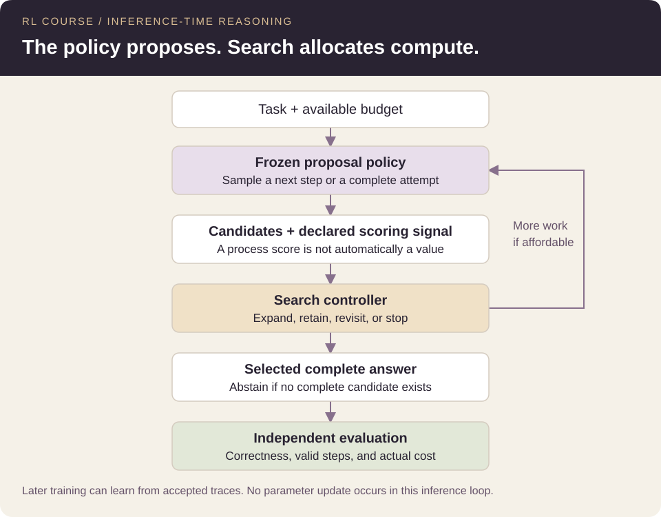

# 45. Search over Reasoning Trajectories

**Advanced · Part III** · **Created by Shivam Bharadwaj**

[← Chapter 44](../44-verifiers-process-rewards-and-value-models/README.md) | [Chapters](../README.md) | [Course home](../../README.md) | [Chapter 46 →](../46-budget-aware-reasoning/README.md)

[Quick read](../../quick-read/45-search-over-reasoning-trajectories.md) · [Notation](../NOTATION.md)

- [45.1 Search changes which prefixes receive attention](#section-45-1)
- [45.2 Define the node and frontier](#section-45-2)
- [45.3 Trace beam search](#section-45-3)
- [45.4 Trace best-first search](#section-45-4)
- [45.5 Explain why pruning can be irreversible](#section-45-5)
- [45.6 Distinguish cumulative likelihood and step scores](#section-45-6)
- [45.7 Introduce MCTS without conflating implementations](#section-45-7)
- [45.8 Audit budget exhaustion and fallback behavior](#section-45-8)
- [45.9 Laboratory investigation](#section-45-9)
- [45.10 Exercises, answers, and reading](#section-45-10)

---

## 45.1 Search changes which prefixes receive attention

Complete-trajectory sampling commits to a path until it finishes. Tree search can inspect partial paths and allocate further proposals based on their scores. Its advantage depends on whether those partial scores predict useful continuations.

**Prerequisites:** Chapters 11, 34, and 42–44. **Learning targets:** trace beam and best-first search, quantify branching costs, and identify what pruning can lose.

The courier can compare junctions before completing every route. A misleading map estimate, however, can prune the only route that would have succeeded.

## 45.2 Define the node and frontier

A node represents a reasoning prefix plus enough metadata for ranking and reconstruction. The frontier contains prefixes eligible for expansion. A completed candidate is stored separately and is not expanded again.

Record the parent, generated child, score, and work spent for each expansion. The demo samples children with replacement and charges duplicate proposals. Deduplication could save later work, but requires defining when two histories are equivalent for future behavior and process evaluation.

## 45.3 Trace beam search

At each depth, expand retained prefixes, score their children, and keep the top w prefixes. The demo samples k children per parent rather than enumerating the full action distribution. This is sampled beam search over reasoning states, distinct from standard token beam search using cumulative log likelihood.

At width w=2, branching k=2, and depth 3, the full configured tree considers 2 children at depth one and 4 at each later depth, totaling 10 proposals. With one scoring unit per child, that is 20 work units. A larger budget alone does not enlarge this fixed tree; width or branching must also change.

## 45.4 Trace best-first search

Maintain a priority queue and repeatedly expand the currently highest-scoring prefix. The implementation ranks by process score, then prefers greater depth for equal scores, then insertion order. Completed candidates are retained for final selection; the remaining frontier can still be explored.

Best-first can revisit alternatives left in the queue after another branch finishes. It does not guarantee shortest solutions or optimal returns under an arbitrary heuristic. Its order and stopping behavior are part of the algorithm, not implementation trivia.

## 45.5 Explain why pruning can be irreversible

Suppose an early prefix gets a low score because it begins with an unusual but necessary transformation. A narrow beam may discard it before its payoff becomes visible. If it is removed permanently, later evidence cannot recover that path without resampling or backtracking.

A perfect score for current local correctness is still not a perfect prediction of future success under all tasks. Some correct prefixes are difficult to complete; some temporarily low-scoring prefixes reflect verifier error. Compare pruning against a small exhaustive reference when the action space makes that feasible.

## 45.6 Distinguish cumulative likelihood and step scores

Summing log action probabilities ranks trajectory likelihood. Summing step rewards ranks a chosen cumulative objective. Averaging process scores normalizes by observed length. These rankings can disagree.

In variable-length tasks, an average can reward short traces that avoid difficult checks, while an unnormalized sum of positive scores can favor unnecessary length. Specify the ranking functional, length treatment, and terminal rule. A column called score is insufficient to reproduce a search procedure.

## 45.7 Introduce MCTS without conflating implementations

Monte Carlo Tree Search commonly combines selection, expansion, rollout or leaf evaluation, and backup of visit statistics. Exploration terms can balance revisiting high-valued children with trying less-visited ones. Its guarantees depend on the exact formulation and assumptions.

The course demo implements sampled beam and best-first search, not MCTS. A proposed extension should define the backed-up quantity, exploration coefficient, terminal reward, leaf evaluator, and resource ledger. Renaming a priority queue MCTS would omit the central visit/backup mechanism.

## 45.8 Audit budget exhaustion and fallback behavior

A partial final layer can leave no complete candidate. The implementation then abstains; it does not call the ground-truth answer function to manufacture a fallback. If some complete candidates exist, choose among them by the declared scorer.

The order of parent expansion matters when budget runs out mid-layer. Retain that order in the trace log. Compare completion rate and selected correctness so a method is not rewarded merely for hiding its unfinished attempts from the denominator.

## 45.9 Laboratory investigation

[Notebook 13](../../notebooks/13_budgeted_reasoning_search.ipynb) compares beam and best-first with complete-candidate methods. Inspect why a configured beam can plateau while best-first continues consuming additional budget.

Vary width and branching separately, then repeat with the misleading scorer. Form a hypothesis about which prefixes will be favored before examining the results. Report generated steps and scoring queries rather than equating the number of returned candidates with total search effort.

## 45.10 Exercises, answers, and reading

1. At depth 4, beam width 2, branching 3, and one-unit scores, what is the full-tree cost if every layer retains two prefixes?
2. Why can increasing only the budget leave beam-search results unchanged?
3. Which mechanism distinguishes MCTS from the implemented best-first search?

Worked answers

1. Proposals total 3+6+6+6=21; scores add 21, giving 42 units. This assumes no early termination or deduplication.
2. The fixed branching and width can exhaust the configured search tree before the budget is used.
3. MCTS maintains and backs up visit/value statistics to guide subsequent selection; the demo uses a fixed prefix score and priority queue without that mechanism.

Read [Tree of Thoughts](https://arxiv.org/abs/2305.10601) and [Test-Time Compute Scaling](https://arxiv.org/abs/2408.03314). Compare their actual search/evaluation definitions rather than treating every branching diagram as the same algorithm.

---

[← Chapter 44](../44-verifiers-process-rewards-and-value-models/README.md) | [Chapters](../README.md) | [Course home](../../README.md) | [Chapter 46 →](../46-budget-aware-reasoning/README.md)
