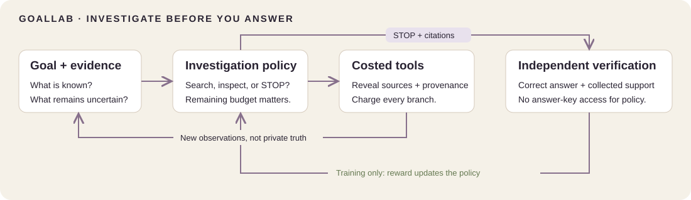

# GoalLab: investigate before you answer

**Train an RL agent to decide what to search, what to trust, and when to stop.**

Created by [Shivam Bharadwaj](https://github.com/bshivambharadwaj) · [Course home](../../README.md) · [Build GoalLab](build-goallab/README.md) · [Measured results](build-goallab/RESULTS.md)

You need the approved number of completed tasks for a progress update. Six sources disagree. Some are outdated, copied, incomplete, irrelevant, or misleading. The agent has a limited investigation budget: it must decide which evidence to acquire, whether to pay for a stronger check, and when it knows enough to answer.

GoalLab makes that investigation a measurable RL problem. Correctness alone is insufficient: the conclusion must be supported by evidence the agent actually collected. A small controller learns tool selection and stopping; deterministic tools handle source parsing and citation assembly.



## Run the reference solution

**Start in your browser:** download [demo.html](demo.html) and open it locally. It animates saved investigations with an evidence graph, remaining budget, inspected sources, contradictions, selected citations, confidence, and final verification. Switch controllers and compare the same case at different budgets. The page clearly labels this mode as recorded playback.

**Execute live investigations:** from the repository root, install `requirements.txt`, then run:

```bash
python -m rl_course.goallab_benchmark_demo \
  --report projects/goallab/build-goallab/results.json \
  --checkpoint projects/goallab/build-goallab/controllers-7.pt
```

Open `http://127.0.0.1:8765`. The page now says **LIVE**: each Step executes a policy decision and workspace tools in Python. Pause stops further requests; Reset creates a fresh investigation. Search displays explored branches and charges their costs, including discarded ones. No external account, paid API, or pretrained model download is needed.

The controller and verifier are deliberately small. Reference training runs on CPU; Colab setup is included in the benchmark notebooks. Hosted free-T4 runtime and memory usage have not been independently measured.

## Build it in two layers

| Learning layer | What you build | Start |
|---|---|---|
| Apply theory: fourteen notebooks | MDPs, value estimation, Q-learning, DQN, policy gradients, preferences, and search on a deliberately simple evidence task. | [Apply theory](apply-theory/README.md) |
| Build GoalLab: five project labs | Richer case generation, cost-aware controllers, a learned verifier, explicit stopping, fair evaluation, and a visual investigation demo. | [Benchmark notebooks](build-goallab/README.md#build-and-investigate) |

The foundational notebooks retain their working two-source environment. The benchmark is GoalLab-v2: six sources, variable-length investigations, three named splits, paid tools, and answer/abstention decisions. The course's separate [algorithm notebooks](../../notebooks/) retain their own focused examples and diagrams.

## What the benchmark measures

**Verified Success @ Budget:** how often does the agent produce a correct, supported answer within the same total work allowance?

Compare **Greedy → DQN → PPO → PPO + Verifier → RL + Test-Time Search** on identical case IDs, permissions, and cost caps. Also inspect answer accuracy, evidence precision and sufficient-proof recall, tool calls, total cost, unsupported claims, confidence calibration, and held-out performance.

| Evidence complication | Investigation decision |
|---|---|
| Stale or contradictory sources | Is another timestamp enough, or should provenance be checked? |
| Copied or irrelevant reports | Is apparent agreement actually independent support? |
| Incomplete content and tables | Which tool can reveal the missing value? |
| Hidden evidence dependencies | What else must be inspected before this source supports a claim? |
| Misleading text | Does final verification reject unsupported completion? |
| Limited budget | Read more, buy authoritative evidence, answer, or abstain? |

Difficulty increases from lookup to contradictions, unreliable cues, dependencies, and adversarial cases. `GoalLab-Train`, `GoalLab-Test`, and `GoalLab-Challenge` use independent deterministic generator streams. The challenge split is a public stress test, not a secret leaderboard.

## Read the failures as well as the scores

The reference comparison includes 4,500 evaluation runs across three training seeds, two splits, three budgets, and five methods. The [results report](build-goallab/RESULTS.md) preserves unsuccessful seeds and a pre-shaping PPO run that learned to abstain. Search can perform worse when its scoring overhead consumes the evidence budget.

This benchmark does not assume that RL or more search beats a strong rule. Its research question is: **how much can better investigation policies and inference-time search improve verified completion without increasing controller size?** The measured results determine the answer for this task.

## Scope and reproducibility

The current benchmark has three candidate totals, six procedurally generated sources, and an explicit support rule. It tests investigation decisions, not natural-language reading, general web research, or deployed-agent reliability. The learned verifier can be wrong; independent final evaluation is not exposed as an inference tool. Python objects are inspectable, so the boundary is logical rather than OS-enforced isolation.

See the [benchmark protocol](build-goallab/PROTOCOL.md), [reference results](build-goallab/RESULTS.md), and [benchmark run instructions](build-goallab/README.md#reproduce-the-benchmark). For the earlier teaching environment, use the [foundations guide](FOUNDATIONS.md), [foundations demo](foundations-demo.html), and [foundations reproducibility notes](REPRODUCIBILITY.md).

Code: [MIT](../../LICENSE-MIT). Educational text and visuals: [CC BY 4.0](../../LICENSE-CC-BY-4.0).
