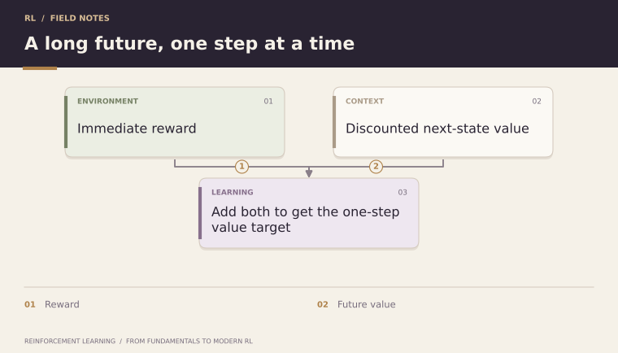

**Quick read** · **Created by Shivam Bharadwaj**

[← Topic 9](09-advantage-functions.md) | [Course home](../README.md) | [Quick reads](README.md) | [Topic 11 →](11-bellman-optimality-equations.md)

**Go deeper:** [Chapter 10: Bellman Expectation Equations](../chapters/10-bellman-expectation-equations/README.md)

---

# 10. Bellman Expectation Equations

The Bellman equation introduces one of RL's deepest ideas: **a long-horizon value can be decomposed recursively**.

For state value:

  

Expanded over actions and transitions:

  

Conceptually:

  

This recursive structure is the foundation of dynamic programming and temporal-difference learning.

### One-step lookahead, with numbers

Suppose an action gives reward −1, then reaches a state of value 8 with probability 0.75 or value 4 with probability 0.25. Its expected one-step target is

  

For Vπ, also average these action-specific targets using the policy's action probabilities. For Qπ, fix the first action and average subsequent actions under the policy:

  

**Analogy:** the remaining travel time equals time to the next junction plus remaining travel time from there. Bellman equations express this consistency for expected discounted reward.

---

**Continue in depth:** [Read Chapter 10](../chapters/10-bellman-expectation-equations/README.md)

[← Topic 9](09-advantage-functions.md) | [Course home](../README.md) | [Quick reads](README.md) | [Topic 11 →](11-bellman-optimality-equations.md)
