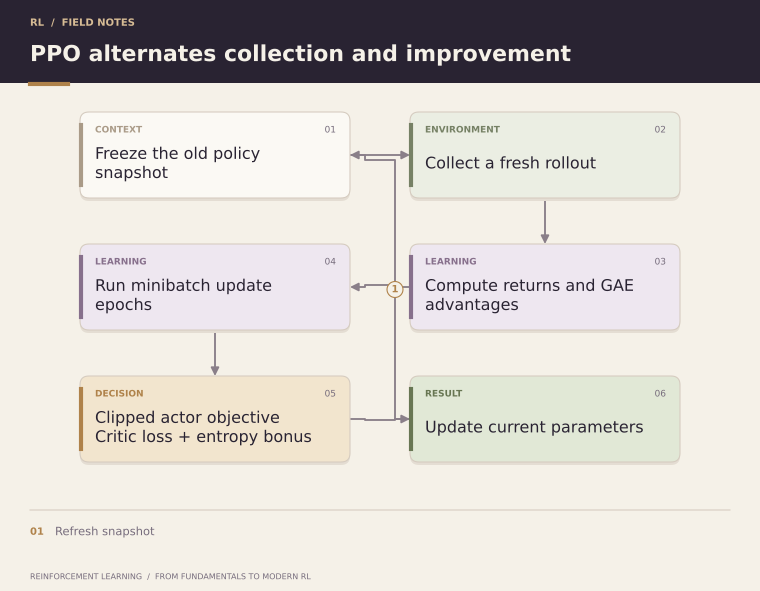

**Quick read** · **Created by Shivam Bharadwaj**

[← Topic 30](30-trust-region-policy-optimization.md) | [Course home](../README.md) | [Quick reads](README.md) | [Topic 32 →](32-entropy-regularization.md)

**Go deeper:** [Chapter 31: Proximal Policy Optimization](../chapters/31-proximal-policy-optimization/README.md)

---

# 31. Proximal Policy Optimization

> **Why this algorithm exists:** TRPO-inspired update control is useful but its constrained solve is involved. PPO uses a simpler clipped surrogate with first-order optimization. Clipping limits incentives in that objective; it is not a hard bound on policy change.

PPO makes constrained policy optimization much easier to implement.

Define the probability ratio

  

The clipped objective is

  

The clipping mechanism discourages excessively large policy changes.

PPO became influential because it combines strong empirical performance with a relatively simple optimization procedure and later became a major algorithm in RLHF pipelines.

**[Try it in Notebook 06 → PPO](../notebooks/06_ppo.ipynb)**

### What clipping does

Let Ât=2 and the clipping width be 0.2. If the probability ratio rises to 1.4, the unclipped contribution is 2.8, but the clipped objective uses 2.4. There is no further gain from increasing this sample's ratio beyond 1.2. For a negative advantage, the corresponding saturation occurs when the ratio becomes too small.

Clipping removes an incentive in the surrogate; it does **not** enforce a hard bound on every probability ratio or guarantee a KL limit. See the original [PPO paper](https://arxiv.org/abs/1707.06347).

  

Keep old log probabilities and advantage targets fixed during each update batch. PPO reuses a recent rollout for several epochs; indefinitely recycling an old replay buffer changes this training setup.

> **Failure Mode — policy collapse:** repeated updates on one rollout can remove useful action diversity or move far beyond the collector. Inspect entropy, approximate KL, task return, and the number of optimization epochs. KL-based early stopping is a diagnostic control, not a rollback guarantee.

**Knowledge check:** can a PPO probability ratio exceed the clipping interval? Yes. The objective clips one term; it does not project all probabilities into an interval.

**Read the source:** [Schulman et al.: PPO](https://arxiv.org/abs/1707.06347).

---

**Continue in depth:** [Read Chapter 31](../chapters/31-proximal-policy-optimization/README.md)

[← Topic 30](30-trust-region-policy-optimization.md) | [Course home](../README.md) | [Quick reads](README.md) | [Topic 32 →](32-entropy-regularization.md)
