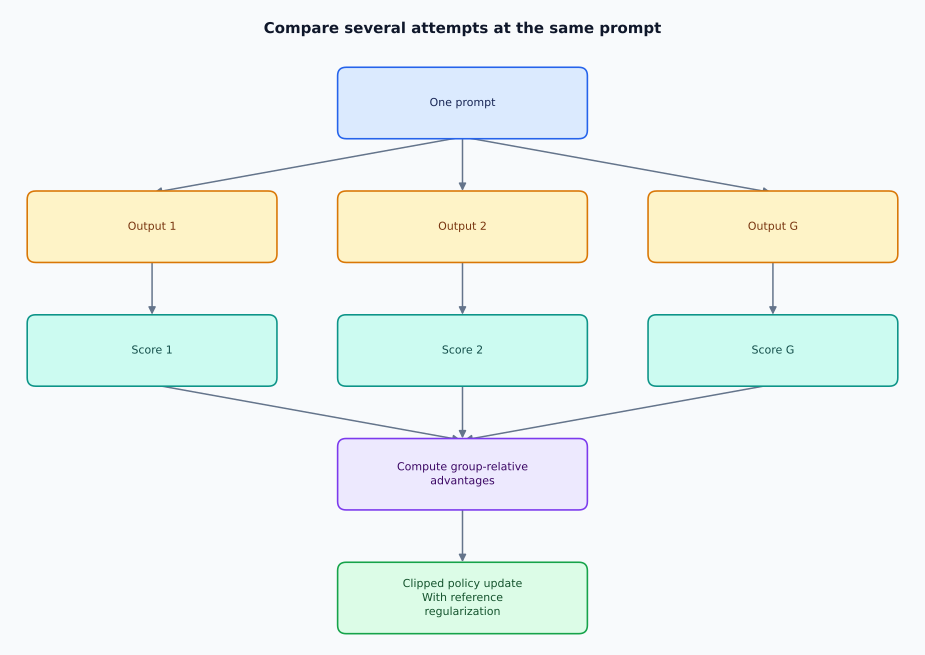

**Quick read** · **Created by Shivam Bharadwaj**

[← Topic 38](38-direct-preference-optimization.md) | [Course home](../README.md) | [Quick reads](README.md) | [Topic 40 →](40-multimodal-rl-and-rl-for-ai-agents.md)

**Go deeper:** [Chapter 39: GRPO and Reinforcement Learning for Reasoning](../chapters/39-grpo-and-reinforcement-learning-for-reasoning/README.md)

---

# 39. GRPO and Reinforcement Learning for Reasoning

> **Why this algorithm exists:** For a prompt with several scored attempts, within-group comparisons can supply advantages without training a separate critic. The savings depend on obtaining informative reward variation; identical scores give no reward-ranking signal.

**[Try it in Notebook 07 → Preferences, DPO, and GRPO](../notebooks/07_preference_and_grpo.ipynb)**

Group Relative Policy Optimization (GRPO) is a policy-optimization approach used in modern reasoning-model training. Instead of requiring a separately learned value model for every update, it can estimate relative advantages by comparing rewards among multiple outputs generated for the same prompt.

A simplified intuition is:

  

This is attractive for reasoning tasks where many candidate solutions can be sampled and scored using verifiable or learned rewards.

Modern reasoning RL raises deeper questions than simply maximizing final-answer correctness: how should intermediate reasoning, efficiency, exploration, tool use, and robustness be rewarded without teaching the model to exploit the evaluator?

**[Try it in Notebook 07 → Preferences, DPO, and GRPO](../notebooks/07_preference_and_grpo.ipynb)**

### A group-relative advantage example

For sampled responses with rewards [0,1,1,0], the mean is 0.5 and population standard deviation is 0.5. The normalized sequence-level signals are approximately [−1,+1,+1,−1]:

  

**Analogy:** compare several attempts at the same puzzle so that feedback is relative to that puzzle's difficulty. If all rewards are equal, this signal is zero; the group offers no reward-based ranking.

The original [DeepSeekMath paper](https://arxiv.org/abs/2402.03300) combines group-relative signals with a clipped policy objective and reference-policy regularization, avoiding a separately trained value model. Normalization alone is not the full algorithm. Variants differ in token weighting and normalization.

With outcome rewards, the same response-level signal can weight multiple token decisions. This does not identify which intermediate step caused success. Verifiable rewards, such as passing tests, reduce dependence on subjective scoring but still depend on evaluator quality.

### Reasoning RL: verify an outcome, inspect the path

Treat a reasoning attempt as a trajectory, not a magical “reasoning score.” Specify the prompt
distribution, candidate sampling budget, output parser, checker, and whether intermediate steps
receive labels. A checker can validate arithmetic or test results while still missing unsupported
claims, brittle strategies, or exploitative formatting.

| Design choice | Benefit | Failure to test |
|---|---|---|
| Outcome reward | Cheap when final correctness is verifiable | Correct answer reached through an invalid intermediate trace |
| Process supervision | More local feedback about intermediate steps | Inconsistent or costly step labels; polished but wrong steps |
| Multiple attempts per prompt | Within-prompt comparisons | All scores tied; sampling cost hidden from comparisons |
| Strict output parser | Reduces answer-list and formatting exploits | Rejecting valid alternatives or accepting ambiguous outputs |
| Token/sequence weighting | Defines how long and short outputs contribute | Length-related reward artifacts and unequal effective weights |

> **Failure Mode — length artifacts:** if longer outputs receive more accumulated shaping reward,
or a loss weights sequences through their token counts, length can become an optimization target.
Report accuracy and reward by length, specify normalization, and compare methods under equal
generation budgets. An arbitrary length penalty may discourage useful work too.

**Run [Notebook 10 → Verifiable Reasoning](../notebooks/10_verifiable_reasoning_grpo.ipynb).** It samples
two-step arithmetic traces, compares outcome and process feedback, and exposes tied groups and
an answer-list attack. Fixed-length structured outputs keep the credit-assignment experiment
inspectable; they do not demonstrate variable-length LLM training.

**Knowledge check:** if all eight candidates fail, does group normalization reveal which failure
was closest to correct? No; identical scalar rewards contain no such ranking.

References: [DeepSeekMath](https://arxiv.org/abs/2402.03300), [Let's Verify Step by Step](https://arxiv.org/abs/2305.20050).

---

**Continue in depth:** [Read Chapter 39](../chapters/39-grpo-and-reinforcement-learning-for-reasoning/README.md)

[← Topic 38](38-direct-preference-optimization.md) | [Course home](../README.md) | [Quick reads](README.md) | [Topic 40 →](40-multimodal-rl-and-rl-for-ai-agents.md)
